<div align="center">
  <h1>Guía para proyectos en Django</h1>
</div>
# Tabla de contenido

* [Introducción](#Introducción)

- [Preparando entorno](#Preparando-entorno)
  - [Configuración de entorno de trabajo](#configuración-de-entorno-de-trabajo)
  - [Creacion de entorno virtual con Python](#Creacion-de-entorno-virtual-con-Python)
  - [Comandos del entorno](#Comandos-del-entorno)
  - [Instalación de Django](#Instalación-de-Django)
  - [Django Admin](#Django-Admin)
  - [Creación de proyecto](#Creación-de-proyecto)
  - [Exploración de los archivos](#Exploración-de-los-archivos)
    - [settings.py](#Archivo-settings.py)
    - [manage.py](#Archivo-manage.py)
  - [Levantar servicio](#Levantar-servicio)
- [Vistas](#Vistas)
  - [Crear la primera vista](#Crear-la-primera-vista)
  - [Como Django procesa un request](#Como-Django-procesa-un-request)
  - [Separando las vistas](#Separando-las-vistas)
  - [El objeto Request](#El-objeto-Request)
  - [Pasando argumentos por URL](#Pasando-argumentos-por-URL)
  - [Crear una app](#Crear-una-app)
  - [Template system](#Template-system)
  - [Pasando datos a nuestro template](#Pasando-datos-a-nuestro-template)
- [Modelos](#Modelos)
  - [Modelo User para la app posts](#Modelo-User-para-la-app-posts)
  - [ORM de Django](#ORM-de-Django)
    - [Queryset](#Queryset)
  - [URL para el Dashboard de Administración](#URL-para-el-Dashboard-de-Administración)
  - [Extendiendo modelo usuario](#Extendiendo-modelo-usuario)
  - [Implementación de modelos](#Implementación-de-modelos)
  - [Implementar modelos en base de datos](#Implementar-modelos-en-base-de-datos)
  - [Reflejar modelos en dashboard de administración](#Reflejar-modelos-en-dashboard-de-administración)
  - [Personalizando detalle de registro de modelo](#Personalizando-detalle-de-registro-de-modelo)
  - [Personalizando Dashboards Nativos](#Personalizando-Dashboards-Nativos)
  - [Relacionando modelos](#Relacionando-modelos)
  - [Hacer funcionar los links](#Hacer-funcionar-los-links)
- [Templates, auth y middlewares](#Templates,-auth-y-middlewares)
  - [Archivos estáticos](##Archivos-estáticos)
  - [Templates](#Templates)
  - [Login y protegiendo vistas](#Login-y-protegiendo-vistas)
  - [Logout](#Logout)
  - [Signup](#Signup)
  - [Middlewares](#Middlewares)
- [Forms](#Forms)
  - [Formularios en Django](#Formularios-en-Django)
  - [Mostrando el form en el template](#Mostrando-el-form-en-el-template)
  - [Models forms](#Models-forms)
  - [Validación de formulario en el Model Form](#Validación-de-formulario-en-el-Model-Form)

# Introducción

Al inicio de la web todo era texto plano ([HTML](https://www.w3schools.com/htmL/)), al transcurrir del tiempo se necesitaban cosas más complejas como conexión a BD’s y de ahi nace [CGIscript](https://es.wikipedia.org/wiki/Interfaz_de_entrada_común)
Nace con el objetivo de que a través de un request, se ejecute un script dentro del servidor, pero esto fue generando problemas con la escabilidad, y por ende difícil de mantener, de esta necesidad nace PHP.
Luego nacen los frameworks para poder resolver tareas comunes, como:

- Protocolos HTTP.
- Conexiones a bases de datos.
- Interacciones con el HTML(templates).

**Django** nace en 2003, con la necesidad de hacer web’s con la filosofía de hacer las cosas de manera agíl.

- Poder hacer sitios escalables.
- URLs bien diseñadas.
- HTTP request y responses.
  -ORM, que es conectar a na DB a traves de una interfaz python.

**Características:**

- Rápido desarrollo.
- Listo para todo.
- Seguro contra ataques.
- Versátil.

**Ventajas:**

- Es desarrollado en Python.
  -DRY(Don’t repeat yourself).
- Comunidad Open Source.

# Preparando entorno

## Configuración de entorno de trabajo
Primero debemos tener instalado Python. Luego de la instalacion abrimos la terminal y nos posicionamos en la ruta que deseamos establecer nuestro proyecto.

## Creación de entorno virtual con Python
Vamos a crear un entorno virtual para nuestro proyecto, el cual contendra todas las dependencias. Es muy importante que este entorno este fuera de nuestro proyecto. Para crearlo ejecutamos:

```bash
virtualenv env
```

Nota: .env sera el nombre de nuestro entorno.

## Comandos del entorno

Para **activar** nuestro entorno ejecutamos

```
source .env/bin/activate
```

Y para **desactivarlo**

```
deactivate
```

Si queremos **listar las librerias instaladas** usamos

```
pip freeze
```

## Instalación de Django
Para **instalar** la ultima version de Django ejecutamos

```
pip install django -U
```

## Django Admin
Es una interfaz instalada junto con Django que contiene subcomandos  utiles. Para listar los subcomandos utilizamos

```bash
django-admin
```

## Creación de proyecto
Para **crear** un proyecto ejecutamos

```bash
django-admin startproject name .
```

> Con `.` le indicamos que creerá el proyecto en path actual.

## Exploración de los archivos

Lo primero que veremos es un folder con el nombre de nuestro proyecto, el cual contiene los archivos:

- **\_\_init_\_.py:** la unica finalidad de este archivo es declarar nuestra carpeta como un modulo de python.
- **settings.py:** es el mas importante, define todas las configuraciones de nuestro proyecto.
- **urls.py:** es el archivo de punto de entrada para todas las peticiones a nuestro proyecto.
- **wsgi.py:** es usado para el deployment a producción y es la interfaz WSGI cuando el servidor corre en producción.
- **manage.py:** es un archivo que no tocamos, pero interactuamos con el durante todo el desarrollo.

### Archivo settings.py
Dentro del archivo setting podemos encontrar variables relevantes para nuestro proyecto, las cuales son:
- **BASE_DIR:** Declara el lugar donde esta corriendo el proyecto. Se considera la linea mas importante.
- **SECRET_KEY:** Es utilizado para el hashing de las contraseñas y las sesiones que se almacenan en las bases de datos.
- **DEBUG:** Determina si nuestro proyecto se encuentra en desarrollo.
- **ALLOWED_HOSTS:** Lista los host que estan permitidos para interactuar con nuestro proyecto.
- **INSTALLED_APPS:** Lista las aplicaciónes instaladas y ligadas a nuestro proyecto.
- **MIDDLEWARE:** Lista los middleware instalados y ligados a nuestro proyecto.
- **ROOT_URLCONF:** Define el archivo principal de urls.
- **TEMPLATES:** Los templates de nuestras aplicaciónes.
- **WSGI_APPLICATION:** Archivo de entrada de nuestro WSGI.
- **DATABASES:** Almacena las configuraciones de las bases de datos.
- **AUTH_PASSWORD_VALIDATORS:** Los validadores de contraseñas.
- **LANGUAGE_CODE:** El idioma en el que se interactua con nuestra aplicación.
- **TIME_ZONE:** Zona horaria en el cual corre nuestra aplicación.
- **STATIC_URL:** En lugar de resolver la url establecidas en el archivo de urls, va a buscar resolver el archivo estático con la url estalecida en esta variable.

### Archivo manage.py
Este archivo contiene un gran listado de **subcomandos** los cuales podemos listar con:

```
python manage.py
```

> `manage.py` es una interfaz de `django-admin`, pero, esta esta relacionada a los settings de nuestro proyectos.

## Levantar servicio

Para levantar el servicio ejecutamos:

```
python manage.py runserver
```

Si queremos cambiar asignarle una ip

```bash
python manage.py runser 192.168.1.2
```

# Vistas

## Crear la primera vista
Para este ejercicio lo haremos simple. En el archivo **urls.py** importamos **django.http.HttpResponse** y definimos una **función** `hello_world` que devuelva una respuesta, y en `urlpatterns` establecemos en que path estará esta respuesta para la url `hello-world/` y al mismo tiempo le pasamos la función.

```python
from django.contrib import admin
from django.urls import path
from django.http import HttpResponse

def hello_world(request):
  return HttpResponse('Hello, world!')

urlpatterns = [
  path('hello-world/', hello_world)
]
```

Corremos nuestro servidor con

```
python manage.py runserver
```

Luego accedemos al [**http://localhost:8000/hello-world**](http://localhost:8000/hello-world) donde podremos acceder a nuestra vista:

## Como Django procesa un request
1. Primero va a buscar en el archivo **settings.py** en la variable **ROOT_URLCONF**
2. Luego Django desde el archivo **urls.py** carga los módulos de **Python** definidos en la variable **urlpatterns**.
3. Dentro de **urlpatterns** se busca el patrón coincida con la petición realizada. Es decir, recorre **urlspatterns** hasta encontrar una url que coincida con la **url** que se esta solicitando.
4. Una vez encontrada la **URL** que coincide, **Django** importa y llama la vista, el cual, se le pasa como segundo argumento en el **path** , dicha vista es una función simple en Python. A la función **Django** se le pasa como argumento lo siguiente:
    - Una instancia del objeto **HttpRequest**.
    - Si la URL pasa mas argumentos entonces los entregara.
    - Si definimos argumentos adicionales también lo enviara.
5. Si ninguna URL coincide, **Django** enviara una excepción.

## Separando las vistas
Es buena practica tener las vistas separadas del archivo `url.py`, por lo que crearemos un archivo **views.py** dentro de nuestra aplicación que contendrá las vistas, el arbol quedaría de la siguiente manera.

```
├── db.sqlite3
├── manage.py
├── platzigram
│   ├── asgi.py
│   ├── __init__.py
│   ├── __pycache__
│   ├── settings.py
│   ├── urls.py
│   ├── views.py <------- Archivo para la vistas -----
│   └── wsgi.py
├── README.md
└── requirements.txt
```

Dentro de nuestro archivo **views.py** importamos `HttpResponse` y traemos nuestra función `hello_world()` creado en `urls.py`

```python
from django.http import HttpResponse

def hello_world(request):
    return HttpResponse('Hello, world!')
```

Ahora debemos importar la función al archivo `urls.py`.

```python
from django.contrib import admin
from django.urls import path
from platzigram import views

urlpatterns = [
    path('hello-world/', views.hello_world)
]
```

Si revisamos la **url** [**http://localhost:8000/hello-world**](http://localhost:8000/hello-world) nuestro proyecto seguirá funcionando.

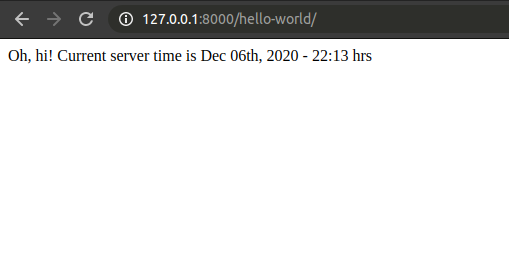

>  Para realizar un `debug` podemos usar `pdb`:
>
> ```python
> import pdb
> pdb.set_trace()
> ```
>
> Cuando el código llegue a esa línea, el código hará un `stop` y abrirá una consola para hacer el debug.
>
> Dentro la consola podemos llamar las variables que queramos.
>
> Este es un ejemplo de un debug para el objeto `request`.
>
> ```bash
> > /home/jonamaita/Escritorio/docs_jonathan/curso_django/platzigram/views.py(17)hi()
> -> return HttpResponse("Hi!")
> (Pdb) request
> <WSGIRequest: GET '/hi/'>
> (Pdb) request.method
> 'GET'
> (Pdb) request.path
> '/hi/'
> (Pdb) 
> ```


## El objeto Request

A través del objeto request podemos acceder a varios atributos  los cuales se encuentran detallados en la [documentación](https://docs.djangoproject.com/en/3.0/ref/request-response/) de **Django**. Algunos atributos útiles son:

- **request.method:** nos muestra el método HTTP ("GET", "POST", etc.) usado por el request en formato de **string** en **UPPERCASE**. Un ejemplo de uso seria:

  ```python
  if request.method == 'GET':
    do_something()
  elif request.method == 'POST':
    do_something_else()
  ```

- **request.GET:** Un diccionario que contiene todos los parámetros entregados por `HTTP GET`. Por ejemplo:

  Pasamos una lista de números en la variable `numbers` de la siguiente manera:

  ```http
  http://localhost:8000/numbers/?numbers=10,2,6,7
  ```

  Para acceder a la lista usamos 

  ```python
  request.GET['numbers']
  ```

  **Nota:** En el siguiente ejemplo se creo la vista **numbers**, el cual, devuelve un **json** con una lista de número de manera ordenada.
  
  Un ejemplo practico seria:

  ```python
  def numbers(request):
      """
      View numbers
      """
    get_numbers = request.GET["numbers"]
      get_numbers = map(int, get_numbers.split(","))
    get_numbers = sorted(get_numbers)
      data = {
          'status': 'ok',
          'numbers': get_numbers,
          "message": "Integers sorted successfully",
  
      }
      response = json.dumps(data, indent=4)
      return HttpResponse(response, content_type='application/json')
  ```
  
  De esta forma podemos ver los valores de number a través de nuetra vista:
  
  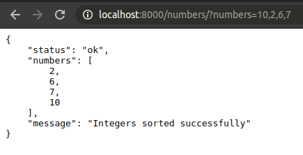

## Pasando argumentos por URL
Podemos pasar argumentos a través de la URL, para esto primero creamos la función que hará uso de estos parámetros y devolverá la vista en el archivo **views.py**
```python
from django.http import HttpResponse

def say_hi(request, name, age):  # pylint: disable = unused-argument
    """
    view say_hi
    """
    if age < 12:
        message = f"Sorry {name}, you are not allowed here"
    else:
        message = f"Hello {name}!, Welcome to Platzigram!"

    return HttpResponse(message)
```

Luego definimos el path para esta vista en el archivo **urls.py**. Para definir los parámetros que pasaran por la url los encerramos con `<>` definiendo el tipo de dato y el nombre del parámetro.

```python
from django.contrib import admin
from django.urls import path
from platzigram import views

urlpatterns = [
  path('hi/<str:name>/<int:age>/', views.say_hi)
]
```

En el resultado final si ingresamos **age = 31** y **name = Jonathan** obtenemos el resultado definido en nuestra función **say_hi()**:

`http://localhost:8000/hi/jonathan/31`

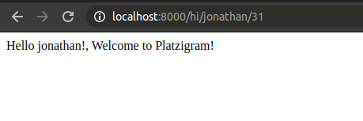


## Crear una app
Con Django podemos crear una app de forma rápida y sencilla ejecutando el comando

```bash
python manage.py startapp <name>
```

En este ejemplo creamos un **app** llamada **posts**, el cual, al ejecutar el comando se genero una carpeta con todos los archivos básicos necesarios.

```bash
── db.sqlite3
├── imgs_README
│   ├── hello_world.png
│   ├── say_hi_view.png
│   └── view_numbers.png
├── manage.py
├── platzigram
│   ├── asgi.py
│   ├── __init__.py
│   ├── __pycache__
│   ├── settings.py
│   ├── urls.py
│   ├── views.py
│   └── wsgi.py
├── posts <--------- Aplicación Creada -----
│   ├── admin.py
│   ├── apps.py
│   ├── __init__.py
│   ├── migrations
│   │   └── __init__.py
│   ├── models.py
│   ├── tests.py
│   └── views.py
├── README.md
└── requirements.txt
```

Dentro de la aplicación creada tenemos un archivo llamada `apps.py` en este archivo podemos configurar o realizar settings para dicha app. Las configuraciones para la **app** la podemos ver en sel siguiente [enlace](https://docs.djangoproject.com/en/3.1/ref/applications/) en el apartado de **Configuración de la aplicación**. Colocamos un `verbose_name` para darle un nombre mas Legible.

```python
"""
Posts application module
"""
from django.apps import AppConfig


class PostsConfig(AppConfig):
    """
    Posts application settings.
    """
    name = 'posts'
    verbose_name = "Posts"
```

Luego vamos al archivo **settings** de nuestro proyecto, en este caso `./platzigram/settings.py` donde incorporaremos en la variable **INSTALLED_APPS** nuestra nueva app.

```python
INSTALLED_APPS = [
    # Django apps
    'django.contrib.admin',
    'django.contrib.auth',
    'django.contrib.contenttypes',
    'django.contrib.sessions',
    'django.contrib.messages',
    'django.contrib.staticfiles',

    # Local apps
    'posts',
]
```

Para desplegar una vista de esta aplicación vamos al archivo `./posts/views.py` donde crearemos una vista a través de la función **list_posts()**:

```python
from django.shortcuts import render
from django.http import HttpResponse

def list_posts(request):
  posts = [1, 2, 3, 4]
  return HttpResponse(str(posts))
```

Ahora nos toca asignar un `path` para nuestra vista **list_posts()**. Para eso vamos al archivo **urls.py** de nuestro proyecto, en este caso `./platzigram/urls.py` e importamos nuestra nueva app, y le asignamos un path a nuestra vista.

Para que no existan conflictos al llamar views vamos asignar un **alias** para las views de cada aplicacion.

```python
from django.contrib import admin
from django.urls import path
from platzigram import views as local_views

# Importamos las vistas de nuestra aplicacion posts
from posts import views as posts_views

urlpatterns = [
    
    path('hello-world/', local_views.hello_world),
    path('numbers/', local_views.numbers),
    path('hi/<str:name>/<int:age>/', local_views.say_hi),

    # Asignamos el path para nuestra vista list_posts
    path('posts/', posts_views.list_posts),

]
```

Ahora vamos a [**http://localhost:8000/posts/**](http://localhost:8000/posts/) para ver nuestro resultado.

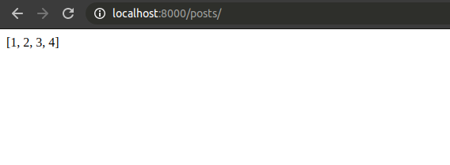


## Template system

El template system es una manera de mostrar los datos usando HTML, incluye lógica de programación lo cual nos facilita un poco el crear nuestros templates.

Para crear nuestros templates lo que haremos es dentro de nuestra aplicación **crear una carpeta templates** y un **archivo html** con el nombre de nuestro template, en este caso `feed.html`.

```bash
├── db.sqlite3
├── imgs_README
│   ├── hello_world.png
│   ├── posts_views_1.png
│   ├── say_hi_view.png
│   ├── template_system_1.png
│   └── view_numbers.png
├── manage.py
├── platzigram
│   ├── asgi.py
│   ├── __init__.py
│   ├── __pycache__
│   ├── settings.py
│   ├── urls.py
│   ├── views.py
│   └── wsgi.py
├── posts
│   ├── admin.py
│   ├── apps.py
│   ├── __init__.py
│   ├── migrations
│   │   ├── __init__.py
│   │   └── __pycache__
│   ├── models.py
│   ├── __pycache__
│   ├── templates <-------- Archivo Template Creado ---
│   │   └── feed.html <------ archivo html creado -----
│   ├── tests.py
│   └── views.py
├── README.md
└── requirements.txt
```

Dentro de nuestro archivo **feed.html** solo escribiremos:

```html
Hola, mundo!
```

Y dentro de **views.py** de nuestra aplicación ya no es necesario el HttpResponse, por que borramos su importación. A través de la vista devolveremos nuestro nuevo template con el método **render**,  a dicho método le pasaremos las variables:

* `request` la cual le agregará contexto a nuestro template, es decir, con `request` le pasamos variables a nuestro template (esto lo veremos mas adelante).
* Nombre del template `feed.html`:

```python
from django.shortcuts import render

def list_posts(request):
    return render(request, 'feed.html')
```

Si revisamos el path [**http://localhost:8000/posts/**](http://localhost:8000/posts/) tendremos nuestro "Hola, mundo!":

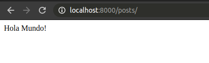

¿Como logro funcionar si dentro de render jamas definimos la ruta donde buscar nuestro template? (en nuetro caso solo `feed.html`). Si revisamos en el archivo **settings.py** de nuestro proyecto, en la definición de **TEMPLATES** veremos:

```python

...

TEMPLATES = [
    {
        'BACKEND': 'django.template.backends.django.DjangoTemplates',
        'DIRS': [],
        'APP_DIRS': True,
        'OPTIONS': {
            'context_processors': [
                'django.template.context_processors.debug',
                'django.template.context_processors.request',
                'django.contrib.auth.context_processors.auth',
                'django.contrib.messages.context_processors.messages',
            ],
        },
    },
]

...

```

En **APP_DIRS** lo tenemos definido como **True**, esto significa que dentro de cada aplicación va a buscar los templates que definamos y así no tenemos que nombrar la dirección de nuestros templates.

## Pasando datos a nuestro template

Primero crearemos un diccionario de datos dentro de nuestra vista (solo a modo de ejemplo) y enviaremos al template estos datos a traves del render. En nuestro caso este diccionario sera posts

```python
"""
Posts Views
"""

from datetime import datetime

from django.shortcuts import render

# Create your views here.

posts = [
    {
        'title': 'Mont Blanc',
        'user': {
            'name': 'Yésica Cortés',
            'picture': 'https://picsum.photos/60/60/?image=1027'
        },
        'timestamp': datetime.now().strftime('%b %dth, %Y - %H:%M hrs'),
        'photo': 'https://picsum.photos/800/600?image=1036',
    },
    {
        'title': 'Via Láctea',
        'user': {
            'name': 'Christian Van der Henst',
            'picture': 'https://picsum.photos/60/60/?image=1005'
        },
        'timestamp': datetime.now().strftime('%b %dth, %Y - %H:%M hrs'),
        'photo': 'https://picsum.photos/800/800/?image=903',
    },
    {
        'title': 'Nuevo auditorio',
        'user': {
            'name': 'Uriel (thespianartist)',
            'picture': 'https://picsum.photos/60/60/?image=883'
        },
        'timestamp': datetime.now().strftime('%b %dth, %Y - %H:%M hrs'),
        'photo': 'https://picsum.photos/500/700/?image=1076',
    }
]


def list_posts(request):  # pylint: disable = unused-argument
    """
    View to lists posts
    """
    return render(request, 'feed.html', {'posts': posts})
```

Si logran observar enviamos los datos a través de **{'posts': posts}**, el cual el **primer parámetro sera el nombre de la variable** y el **segundo es el valor asignado**. 

En nuestro template _feed.html_ ahora imprimiremos nuestro diccionario escribiendo el **nombre de la variable**.

```html
{{ posts }}
```

Si revisamos [**http://localhost:8000/posts/**](http://localhost:8000/posts/) veremos nuestro diccionario.

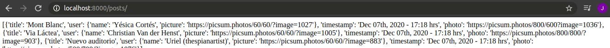

Ahora juguemos un poco con la **lógica de programación** y **html**. Vamos a imprimir solo los títulos. Para eso en nuestro **template** _feed.html_ escribiremos:

```html

  <p>{{ post.title }}</p>

```

Y el resultado en [**http://localhost:8000/posts/**](http://localhost:8000/posts/)

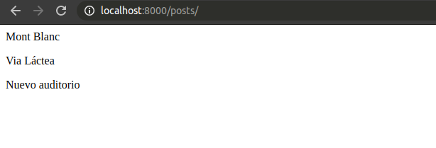


Para ver toda la **lógica de programación** que podemos crear en el template system te recomiendo ir a la [documentación de Django.](https://docs.djangoproject.com/en/3.0/ref/templates/builtins/)

Ahora despleguemos los datos de nuestro diccionario y estilemos con **Bootstrap** nuestro template `feed.html`.

```html
<!DOCTYPE html>
<html lang="en">
<head>
  <meta charset="UTF-8">
  <title>Platzigram</title>
  <link rel="stylesheet" href="https://stackpath.bootstrapcdn.com/bootstrap/4.1.1/css/bootstrap.min.css" integrity="sha384-WskhaSGFgHYWDcbwN70/dfYBj47jz9qbsMId/iRN3ewGhXQFZCSftd1LZCfmhktB" crossorigin="anonymous">
</head>
<body>
  <br><br>
  <div class="container">
    <div class="row">
      
      <div class="col-lg-4 offset-lg-4">
        <div class="media">
          
          <div class="media-body">
            <h5 class="mt-0">{{ post.user.name }}</h5>
            {{ post.timestamp }}
          </div>
        </div>
        
        <h6 class="ml-1 mt-1">{{ post.title }}</h6>
      </div>
      
    </div>
    </div>
</body>
</html>

```

Y en [**http://localhost:8000/posts/**](http://localhost:8000/posts/) veremos

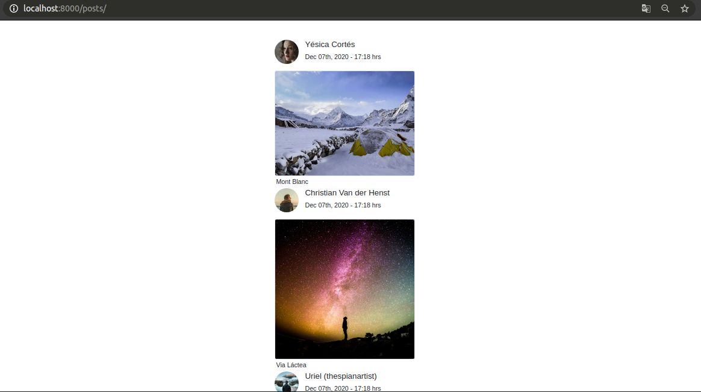

## Patrones de diseños y Django

En este apartado se describirá un poco de la aproximación de **Django** al patrón de diseño **MVC** (Model, View, Controller) usando **MTV** (Model, Template, View). 

Anteriormente se realizaba la conexión con la base de datos y lógica de la vista mezclada con el template en un solo archivo, esto hacía que el código no fuera nada manteniente, de igual manera, en los script de **cgi** se aplicaba literalmente lo mismo. En decir, en mismo archivo anteriormente se tenía, conexión a la base de datos, lógica para el tratado de los datos y lógica para la presentación de los datos, esto es un problema muy común en el desarrollo web.

Para problemas antes mencionados existen patrones de diseños, los cuales son soluciones reutilizables a un problema común, los patrones diseños se encuentran para múltiples problema en programación y para el desarrollo web principalmente existe **MVC** (Model, View, Controller).

### MVC (Model View Controller)

**MVC** es una manera de separar los datos de la presentación y de la lógica.

* **Model:** Es el que se encarga de la estructura de los datos, el acceso a ellos e incluso la validación.
* **View:** Se encarga de presentar los datos al usuario.
* **Controller:** Es es el que maneja la lógica del `request`, sabe que hacer en ese momento y sabe que template tiene que utilizar. También sabe que datos tiene que intercambiar con el modelo.

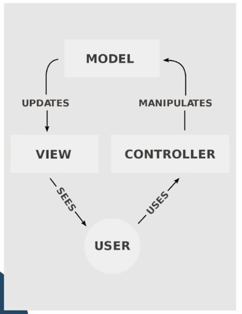

**Django** implementa algo similar con **MTV** (Model Template View).


###  **MTV** (Model Template View).

 **MTV** funciona de la siguiente manera:

* **Modelo:** Se encara de definir la estructura de los datos, es decir, es la forma en la que creamos esquemas de objetos (un usuario, un post, etc) para representarlos en nuestra base de datos.
* **Template:** Es La lógica de presentación de los datos.
* **View o Vista:** Es el encargado de decir que template va a presentar los datos y se encarga de pasar los datos al template.

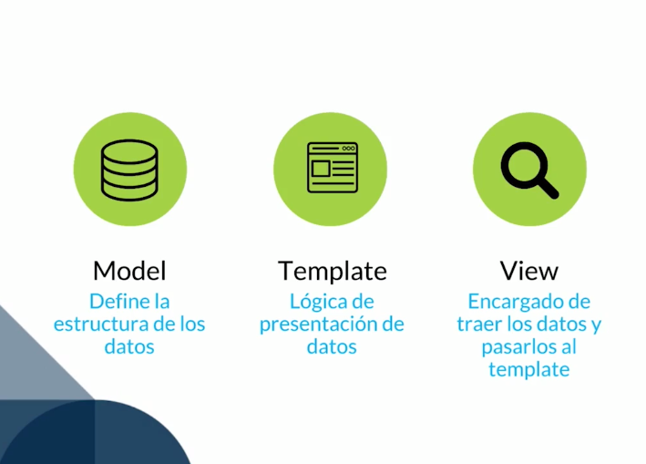

> Si vemos **Django** como un **MVC**:
>
> El **controller** sería la vista y las **urls** que maneja esa lógica.
>
> Las **Views** sería los templates.
>
> **MTV => MVC:**
>
> * Models => Model
> * Templates => View
>
> - Views + Urls => Controller


# Modelos

El Modelo en Django usa diferentes opciones para conectarse a múltiples bases de datos relacionales, entre las que se encuentran: SQLite, PostgreSQL, Oracle y MySQL.
Para la creación de tablas, Django usa la técnica del ORM (Object Relational Mapper), una abstracción del manejo de datos usando OOP.

## Modelo User para la app Posts

Crearemos un modelo `User` de juguete para la app `posts`, declaramos el modelo en el archivo `model.py` de la aplicación. Los campos de los modelos los pueden encontrar en la siguiente [documentación](https://docs.djangoproject.com/en/3.1/ref/models/fields/). El modelo sería el siguiente:

```python
"""
Models posts
"""

from django.db import models

# Create your models here.

class User(models.Model):
    """
    User Model
    """
    email = models.EmailField(unique=True)
    password = models.CharField(max_length=100)
    first_name = models.CharField(max_length=100)
    last_name = models.CharField(max_length=100)
    bio = models.TextField(blank=True)
    birthdate = models.DateField(blank=True, null=True)
    created = models.DateTimeField(auto_now_add=True)
    modified = models.DateTimeField(auto_now=True)

```

* **auto_now_add:** En cuanto se cree una instancia de ésta tabla en la base de datos, le va a cargar la fecha en la que se creó.
* **auto_now:** Guarda la fecha en la que se editó por última vez.


## ORM de Django

Para usar el ORM en la shell de python debemos ejecutar el siguiente comando:

```python
python manage.py shell
```

Esto abrirá la misma consola de `python`, pero, con **Django** cargado. En el siguiente link https://docs.djangoproject.com/en/3.1/topics/db/queries/ podemos leer la documentación para hacer `queries`.

A modo de ejemplo creamos un usuario de la siguiente manera y veremos sus atributos:

```bash
>>> jonathan = User.objects.create(
...     email = 'JM@gmail.com',
...     password = '12345667',
...     first_name = 'Jonathan',
...     last_name = 'Maita',
... )
>>> jonathan.email
'JM@gmail.com'
>>> jonathan.password
'12345667'
>>> jonathan.first_name
'Jonathan'
>>> jonathan.last_name
'Maita'
```

> Como se podrá notar hay algunos campos que se no definieron, ya que, en el modelo antes realizado nos permite dejarlos vacío.

Podemos editar los atributos o valores del objeto antes creado:

```bash
>>> jonathan.email = 'JM@hotmail.com'
>>> jonathan.save()
>>> jonathan.email
'JM@hotmail.com'
>>> jonathan.created
datetime.datetime(2020, 12, 8, 15, 14, 44, 787506, tzinfo=<UTC>)
>>> jonathan.modified
datetime.datetime(2020, 12, 8, 15, 25, 56, 599520, tzinfo=<UTC>)
```

Otra forma de crear datos es instanciando la clase:

```bash
>>> sussy = User()
>>> sussy.email = 'sussy@gmail.com'
>>> sussy.first_name = 'sussy'
>>> sussy.last_name = 'vader'
>>> sussy.password = 'sussy123456'
>>> sussy.is_admin = True
>>> sussy.save()
```

Con el método `.save()` guardamos los datos  en la base de datos.

Ahora bien si queremos borrar un usuario, usamos el método `.delete()`:

```bash
>>> pablo.delete()
(1, {'posts.User': 1})
>>> 
```

#### Queryset

A continuación se harán algunas `queryset`, en la siguiente `queryset` traemos un usuario por su email.

```bash
>>> user = User.objects.get(email='freddier@platzi.com')
>>> user
<User: User object (7)>
>>> user.pk
7
>>> user.email
'freddier@platzi.com'
>>> user.password
'987654321'
```

En la siguiente `queryset` podemos usar `filter`, para traer todos los usuarios que con email `@platzi.com`.

```bash
>>> users = User.objects.filter(email__endswith='@platzi.com')
>>> users
<QuerySet [<User: User object (6)>, <User: User object (7)>, <User: User object (8)>, <User: User object (9)>]>
>>> for user in users:
...     print(user.email)
... 
cvander@platzi.com
freddier@platzi.com
yesica@platzi.com
arturo@platzi.com
>>> 
```

Hacer un **update** a todos los users:

```bash
>>> users = User.objects.filter(email__endswith='@platzi.com').update(is_admin=True)
>>> users
4
>>> users = User.objects.filter(email__endswith='@platzi.com')
>>> for user in users:
...     print(f'{user.email}, is admin: {user.is_admin}')
... 
cvander@platzi.com, is admin: True
freddier@platzi.com, is admin: True
yesica@platzi.com, is admin: True
arturo@platzi.com, is admin: True
>>> 
```

Podemos ver que cuando hacemos un `update`, regresa un entero con todos lo usuarios actualizados, en este caso se actualizaron 4 usuarios.

## Creación de Super Usuario

Para crear un **super usuario** en Django es bastante facil. En la consola escribimos

```
python3 manage.py createsuperuser
```

Nos preguntara un **username, email (opcional), y contrañesa**, con esto ya tendríamos nuestro super usuario.

## URL para el Dashboard de Administración

Django cuenta con un dashboard de administración. Para acceder a el debemos darle un `path` dentro del archivo **urls.py** de nuestro proyecto (este path normalmente viene por defecto cuando iniciamos un proyecto). Para esto importamos **django.contrib.admin** y le asignamos la dirección que deseamos

```python
from django.contrib import admin
from django.urls import path

urlpatterns = [
  path('admin/', admin.site.urls),
]
```

En este caso le dimos el path **/admin/** para acceder a el. Entonces vamos a la dirección [**http://localhost:8000/admin/**](http://localhost:8000/admin/) para ingresar.

Para ingresar utilizaremos el **super usuario** que creamos en la [**sección de creación de super usuario.**](#creación-de-super-usuario)

## Extendiendo modelo usuario

El modelo de usuarios que acabamos de construir funciona bien y es válido, sin embargo tiene algunas cosas que podrían representar fallas de seguridad en la aplicación. Por esto vamos a explorar el modelo de usuarios que nos provee Django.

Con el `auth.model`, podemos crear un usuario directamente en la shell con el modelos de usuarios que nos provee Django:

```bash
>>> from django.contrib.auth.models import User
>>> 
>>> u = User.objects.create_user(username="sussy", password="sussy123")
>>> u.pk
1
>>> u
<User: sussy>
>>> u.username
'sussy'
>>> u.password
'pbkdf2_sha256$216000$wJcPR2CX76cY$0nNC1SJvMdJ/bWumQjhVZjXvNYp3Hkt6AEn9uFjgSao='
>>> 
```

Podemos observar que, cuando se crea un `password` el modelo encripta dicha `password` con llave secreta de **Django**.

Dicho modelo esta casi completo, pero, aveces podemos necesitar mas campos y por ende necesitamos extenderlo. Si entramos al código fuente de **Django** podemos observar que la clase **User** de **Django** extiendo la clase **AbstractUser**, el cual, dicha clase tiene todos los métodos y atributos básico para un modelo de usuarios.

## Implementación de modelos usuarios

Las opciones que Django propone para extender el modelo Usuarios  y personalizarlos son:

- Usando el Modelo proxy.
- Extendiendo la clase abstracta de Usuario existente.

[Documentación para extender el modelo usuario usando el modelo Proxy](https://docs.djangoproject.com/en/3.1/topics/auth/customizing/#extending-the-existing-user-model).

[Documentación para extener del modeulo usuario usando la clase abstracta de Usuario](https://docs.djangoproject.com/en/3.1/topics/auth/customizing/#using-a-custom-user-model-when-starting-a-project).

En este caso usaremos el Modelo proxy para extender y personalizar nuestro modelo.

Como hemos visto anteriormente con Django podemos crear modelos de clases de nuestra aplicación. Para extender el modelo usuario crearemos una nueva aplicación de usuarios en nuestro proyecto.

```bash
python manage.py startapp users
```

En el archivo **models.py** de la nueva aplicación crearemos el modelo de nuestros usuarios, el cual sera una clase _Profile_, y los tipos de valores para la clase _models_ estan definidos en la [documentación.](https://docs.djangoproject.com/en/3.0/ref/models/fields/)

Para poder cargar las referencias de imágenes en nuestro modelo instalaremos en nuestro ambiente Pillow, esto nos servirá para la siguiente sección.

```
pip install pillow
```

Ahora creamos el modelo de usuarios.

```python
from django.contrib.auth.models import User
from django.db import models

class Profile(models.Model):

  user = models.OneToOneField(User, on_delete=models.CASCADE)

  website = models.URLField(max_length=200, blank=True)
  biography = models.TextField(blank=True)
  phone_number = models.CharField(max_length=20, blank=True)

  picture = models.ImageField(
    upload_to='users/pictures', 
    blank=True, 
    null=True
  )

  created = models.DateTimeField(auto_now_add=True)
  modified = models.DateTimeField(auto_now=True)

  def __str__(self):
    return self.user.username
```

Recordemos que debemos declarar nuestra aplicación en el`settings.py` antes de hacer las migraciones:

```python
INSTALLED_APPS = [
    #  Django apps
    'django.contrib.admin',
    'django.contrib.auth',
    'django.contrib.contenttypes',
    'django.contrib.sessions',
    'django.contrib.messages',
    'django.contrib.staticfiles',

    #  Local apps
    'posts',
    'users',
]
```

Ahora de debemos realizar las migraciones para el modelo creado de la aplicación `users`. Primero debemos auditar los cambios en los modelos con:

```
python manage.py makemigration
```

Ahora aplicaremos los cambios auditados en nuestra base de datos.

```
python manage.py migrate
```

## Reflejar modelos en dashboard de administración

En primera instancia no podremos ver los _modelos_ que creamos en el dashboard de administración. La clase **ModelAdmin** es la representación del modelo en la interfaz de administración. Para reflejarlo debemos almacenar el _modelo_ en el archivo **admin.py** de nuestra aplicación.

```python
# Django
from django.contrib import admin

# Modelos
from users.models import Profile

# Registramos nuestros modelos aquí.
admin.site.register(Profile)
```

De esta forma tendremos la interfaz de administración predeterminada, en nuestro caso incluimos el modelo **Profile**.

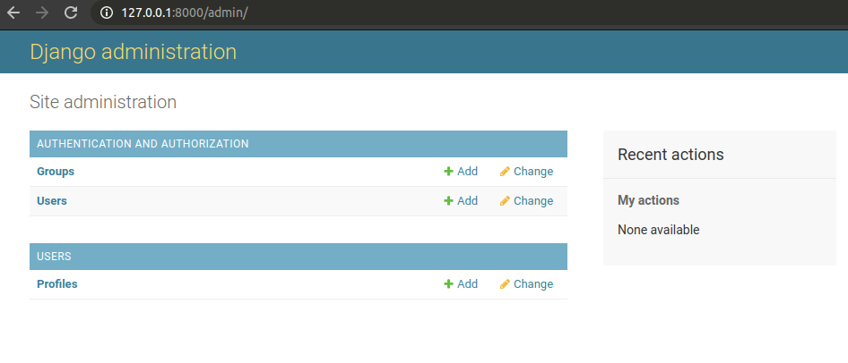

Si queremos mostrar nuestra lista de modelos de una forma personalizada, con **Django** podemos realizarlo. Para esto debemos crear una clase y extender `admin.ModelAdmin`.

```python
# Django
from django.contrib import admin

# Modelo
from users.models import Profile

# Decoramos la clase con el modelo.
@admin.register(Profile)
class ProfileAdmin(admin.ModelAdmin): #Por convencion la clase que creemos debe terminar en Admin.

  # Con list_display nombramos los campos que queremos visualizar.
  list_display = ('pk', 'user', 'phone_number', 'website', 'picture')

  # list_display_links establece como links los campos nombrados.
  list_display_links = ('pk', 'user')

  # list_editable nos permite editar el campo desde 
  # la lista del modelo en vez de ingresar al detalle del registro.
  list_editable = ('phone_number',)

  # Para crear un buscador hacemos uso de search_fields. 
  # Los campos que se ingresan seran los que el buscador recorrera para realizar las busquedas.
  search_fields = (
    'user__email',
    'user__username', 
    'user__first_name', 
    'user__last_name', 
    'phone_number'
  )

  # Podemos crear un filtro para nuestro dashboard del modelo, 
  # para ello usamos list_filter, y definimos los campos con los que trabajara.
  list_filter = (
    'user__is_active',
    'user__is_staff',
    'created', 
    'modified'
  )
```

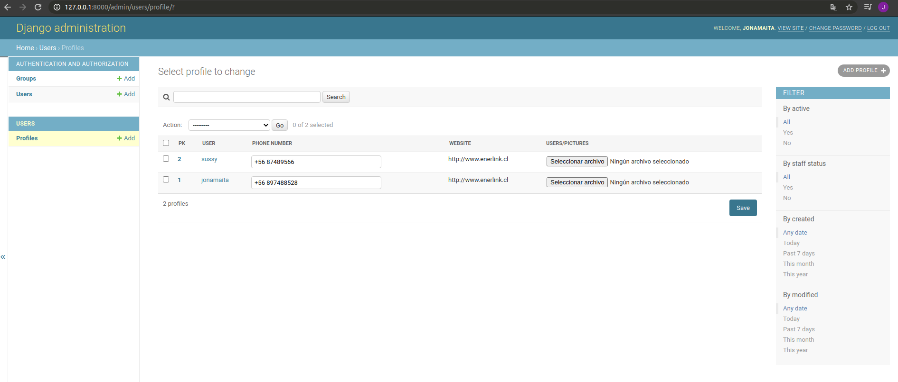


Para mas opciones de personalización siempre puedes revisar la [documentación.](https://docs.djangoproject.com/en/3.0/ref/contrib/admin/#modeladmin-options)

## Personalizando detalle de registro de modelo

Podemos personalizar nuestros dashboard del registro. En nuestro caso lo haremos para el modelo de usuarios `Profile`.

Antes de modificar el modelo `Profile` en el admin se ve de la siguiente forma:

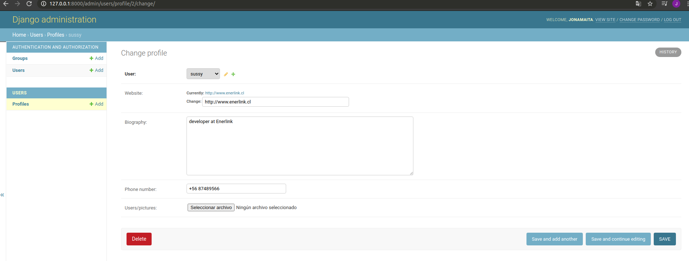


```python
"""
User admin classes.
"""

from django.contrib import admin

from users.models import Profile

#Por convencion la clase que creemos debe terminar en Admin.
@admin.register(Profile)
class ProfileAdmin(admin.ModelAdmin):
    """
    Profile admin.
    """
    # Con list_display nombramos los campos que queremos visualizar.
    list_display = ("pk", "user", "phone_number", "website", "picture")

    # list_display_links establece como links los campos nombrados.
    list_display_links = ("pk", "user")

    # list_editable nos permite editar el campo desde la lista del modelo en
    # vez de ingresar al detalle del registro.
    list_editable = ("phone_number", "picture")

    # Para crear un buscador hacemos uso de search_fields. Los campos que se
    # ingresan seran los que el buscador recorrera para realizar las busquedas.
    search_fields = (
        "user__email", # Se coloca doble underscore cuando es una relación.
        "user__username",
        "user__first_name",
        "user__last_name",
        "phone_number",
    )

    # Podemos crear un filtro para nuestro dashboard del modelo, para ello
    # usamos list_filter, y definimos los campos con los que trabajara.
    list_filter = (
        "user__is_active", # Se coloca doble underscore cuando es una relación.
        "user__is_staff",
        "created",
        "modified",
    )

    # Nos desplagara los datos que deseamos. Es importante que la información
    # este en tuplas.
    fieldsets = (
        (
            "Profile", { # Nombre de la sección o titulo
                "fields": ( # Los campos que visualizaremos.

                        # Cuando declaramos varios campos en la misma tupla
                        # se va a desplegar los datos en la misma fila.
                        ("user", "picture"),
                    ),
                }
        ),
        (
            "Extra info", {
                "fields": (

                        # En este caso la información se desplegara en 2 filas
                        # ya que la tupla de fields tiene 2 tuplas.
                        ("website", "phone_number"),
                        ("biography"),
                    ),
            }
        ),
        (
            "Meta data", {
                "fields": (
                    # Estos datos no se pueden modificar, ya que, en el modelo
                    # se declaro que no son editables, por lo que haremos uso
                    # de readonly_fields.
                    ("created", "modified"),
                )
            }

        ),
    )
    # Aqui declararemos los campos que solo pueden ser leidos pero no
    # modificados.
    readonly_fields = ("created", "modified")
```
En la [documentación](https://docs.djangoproject.com/en/3.0/ref/contrib/admin/#modeladmin-options) tenemos muchas mas formas de personalización, no queda dela siguiente manera la personalización del admin `Profile`:

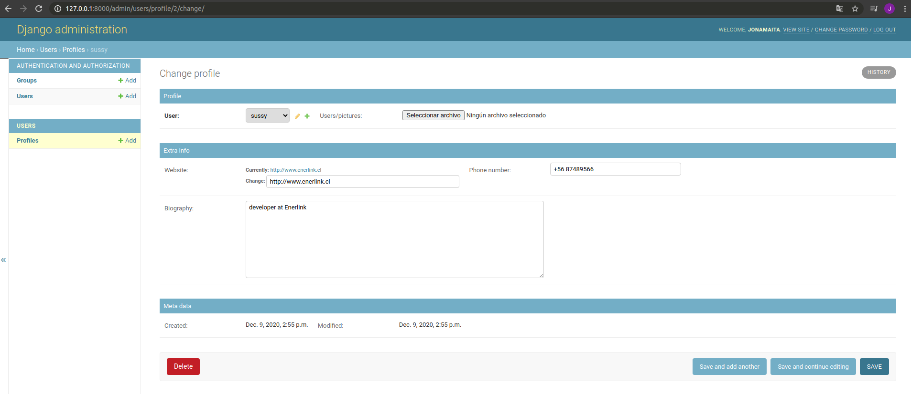


## Personalizando Dashboards Nativos

Existe la posibilidad de personalizar los dashboard nativos de **Django**, para ello vamos a trabajar sobre el modelo de **Users** para el cual vamos a visualizar los datos que definamos y también al momento de crear un usuario también podremos crear dentro del proceso una instancia de nuestro modelo `Profile`.

```python
"""
User admin classes.
"""

from django.contrib import admin
# Importamos UserAdmin
from django.contrib.auth.admin import UserAdmin as BaseUserAdmin

from django.contrib.auth.models import User
from users.models import Profile

#Por convencion la clase que creemos debe terminar en Admin.
@admin.register(Profile)
class ProfileAdmin(admin.ModelAdmin):
    """
    Profile admin.
    """
    # Con list_display nombramos los campos que queremos visualizar.
    list_display = ("pk", "user", "phone_number", "website", "picture")

    # list_display_links establece como links los campos nombrados.
    list_display_links = ("pk", "user")

    # list_editable nos permite editar el campo desde la lista del modelo en
    # vez de ingresar al detalle del registro.
    list_editable = ("phone_number", "picture")

    # Para crear un buscador hacemos uso de search_fields. Los campos que se
    # ingresan seran los que el buscador recorrera para realizar las busquedas.
    search_fields = (
        "user__email", # Se coloca doble underscore cuando es una relación.
        "user__username",
        "user__first_name",
        "user__last_name",
        "phone_number",
    )

    # Podemos crear un filtro para nuestro dashboard del modelo, para ello
    # usamos list_filter, y definimos los campos con los que trabajara.
    list_filter = (
        "user__is_active", # Se coloca doble underscore cuando es una relación.
        "user__is_staff",
        "created",
        "modified",
    )

    # Nos desplagara los datos que deseamos. Es importante que la información
    # este en tuplas.
    fieldsets = (
        (
            "Profile", { # Nombre de la sección o titulo
                "fields": ( # Los campos que visualizaremos.

                        # Cuando declaramos varios campos en la misma tupla
                        # se va a desplegar los datos en la misma fila.
                        ("user", "picture"),
                    ),
                }
        ),
        (
            "Extra info", {
                "fields": (

                        # En este caso la información se desplegara en 2 filas
                        # ya que la tupla de fields tiene 2 tuplas.
                        ("website", "phone_number"),
                        ("biography"),
                    ),
            }
        ),
        (
            "Meta data", {
                "fields": (
                    # Estos datos no se pueden modificar, ya que, en el modelo
                    # se declaro que no son editables, por lo que haremos uso
                    # de readonly_fields.
                    ("created", "modified"),
                )
            }

        ),
    )
    # Aqui declararemos los campos que solo pueden ser leidos pero no
    # modificados.
    readonly_fields = ("created", "modified")


# Para incluir el módelo Profile en el módelo User, hacemos lo siguiente.
class ProfileInline(admin.StackedInline):
    """
    En esta clase definiremos el modelo que deseamos asociar a User, en nuestro
    caso Profile.
    """

    model = Profile
    can_delete = False
    verbose_name_plural = "profiles"

# Luego para asociar los modelos e insertarlo en el Dashboard usaremos
# el UserAdmin de Django el cual le dimos el alias de BaseUserAdmin.
class UserAdmin(BaseUserAdmin):
    """
    Add Profile admin to base user admin.
    """

    inlines = (ProfileInline,)
    list_display = ( # En list_display
    "username",
    "email",
    "first_name",
    "last_name",
    "is_active",
    "is_staff",
  )

# Re-register UserAdmin
admin.site.unregister(User)
# Le pasamos el modelo y la clase que va a usar
admin.site.register(User, UserAdmin)
```

La clase `UserAdmin` lo que hace es sobrescribir la clase heredada o extendida `BaseUserAdmin`.

Si vamos a crear un nuevo **User** podremos encontrar los campos asociados a nuestro modelo `Profile` que definimos en la variable `inlines`

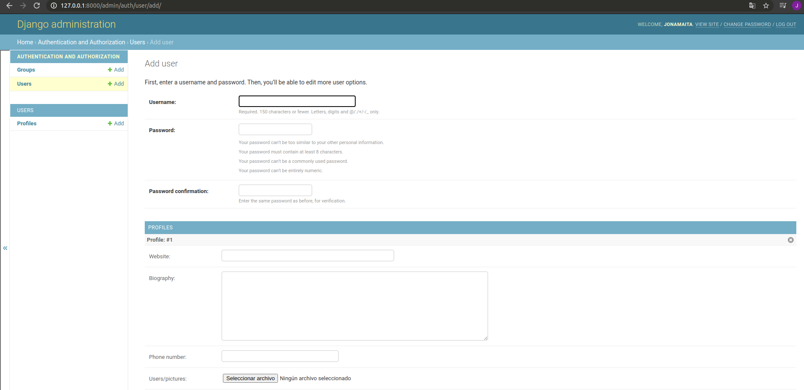


Y si revisamos la lista de registro **User** veremos los cambios realizados en la variable `list_display`.

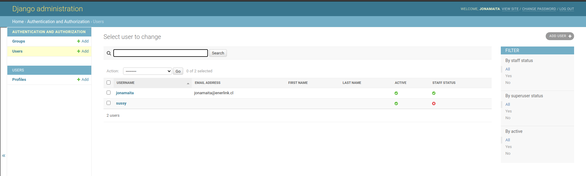


En la [documentación](https://docs.djangoproject.com/en/3.1/topics/auth/customizing/#extending-the-existing-user-model) tenemos muchas mas formas de personalización.

## Relacionando modelos

¿Que pasa si en nuestro proyecto un modelo depende de otro? Un ejemplo de esto puede ser un **_post_** que solo es posible que exista si esta relacionado con un **_usuario_**. Afortunadamente en Django podemos relacionar los modelos, en nuestro caso lo haremos con el modelo de **posts**, por lo iremos al archivo _posts/models.py_.

```python
# Django
from django.db import models
from django.contrib.auth.models import User

class Post(models.Model):

  user = models.ForeignKey(User, on_delete=models.CASCADE)
  # Con ForeignKey podemos relacionar el modelo de posts con profile, 
  # y para hacer referencia a la clase relacionada lo hacemos con 
  # el formato de 'aplicacion.NombreClaseDelModelo'.
  profile = models.ForeignKey('users.Profile', on_delete=models.CASCADE)

  title = models.CharField(max_length=255)
  photo = models.ImageField(upload_to='post/photos')

  created = models.DateTimeField(auto_now_add=True)
  modified = models.DateTimeField(auto_now=True)

  def __str__(self):
    return '{} by @{}'.format(self.title, self.user.username)
```

## Hacer funcionar los links

¿Te fijaste que los links de los campos de nuestros registros nos llevaba al detalle de estos? Para que estos links nos lleven realmente a sus referencias debemos realizar algunos cambios en el archivo **urls.py** y **settings.py**.

En nuestro archivo **settings.py** declararemos 2 variables en el fondo del archivo.

```python
...

MEDIA_ROOT = BASE_DIR / "media"
MEDIA_URL = "/media/"
```

Luego iremos al archivo **urls.py** y a _urlpatterns_ donde tenemos definidos los path de nuestras aplicaciones vamos a concatenar un valor static

```python
from django.contrib import admin
from django.conf import settings
from django.conf.urls.static import static
from django.urls import path

from platzigram import views as local_views
from posts import views as posts_views

urlpatterns = [

    path('admin/', admin.site.urls),
    
    path('hello-world/', local_views.hello_world),
    path('numbers/', local_views.numbers),
    path('hi/<str:name>/<int:age>/', local_views.say_hi),

    path('posts/', posts_views.list_posts),

  # concatenamos static con los valores definidos en settings.py
] + static(settings.MEDIA_URL, document_root=settings.MEDIA_ROOT)
```

Con esto estaría todo listo para que los valores definidos como links en los dashboard funcionen correctamente.

**DJango** no esta hecho para servir la `MEDIA` y esto es un hack para hacerlo durante desarrollo.

# Templates, auth y middlewares

## Archivos estáticos

Los archivos estáticos son elementos de nuestro proyecto que podremos usar de forma transversal. Técnicamente podemos usar tipo de elemento como estético pero por lo general se hacen uso de **css** e **imágenes.**

En la raíz de nuestro proyecto crearemos una carpeta llamada `static`, y en ella contendrá otras 2 subcarpetas llamadas `css` y `img`. Estas van a contener nuestros archivos **css** e **imagenes** respectivamente.

```bash
.
├── db.sqlite3
├── manage.py
├── platzigram
│   ├── asgi.py
│   ├── __init__.py
│   ├── settings.py
│   ├── urls.py
│   ├── views.py
│   └── wsgi.py
├── posts
│   ├── admin.py
│   ├── apps.py
│   ├── __init__.py
│   ├── models.py
│   ├── templates
│   │   └── feed.html
│   ├── tests.py
│   └── views.py
├── README.md
├── requirements.txt
├── static <---------Carpeta para los archivos estaticos ------
│   ├── css
│   └── img
└── users
    ├── admin.py
    ├── apps.py
    ├── __init__.py
    ├── models.py
    ├── tests.py
    └── views.py
```

Ahora vamos al archivo `settings.py` de nuestro proyecto. Justo debajo de la variable **STATIC_URL** vamos a pegar las variables de **STATICFILES_DIRS** y **STATICFILES_FINDERS**.

```python
...

STATICFILES_DIRS = (
    os.path.join(BASE_DIR, 'static'),
)
STATICFILES_FINDERS = [
    'django.contrib.staticfiles.finders.FileSystemFinder',
    'django.contrib.staticfiles.finders.AppDirectoriesFinder',
]

...
```

Con esto tus archivos estáticos ya pueden ser referenciados.

## Templates

Los templates de nuestro proyecto tienen la capacidad de **extenderse** desde otros templates, asi podremos reutilizar los elementos que deseamos, como por ejemplo un _navbar_.

Para preparar todo iremos al archivo _settings.py_, y en la variable **TEMPLATES** vamos a definir donde buscar los **templates** para nuestro proyecto.

```python
TEMPLATES = [
    {
        'BACKEND': 'django.template.backends.django.DjangoTemplates',
        'DIRS': [
            # Aqui definimos la carpeta donde ira a buscar el template nuestras aplicaciones.
            os.path.join(BASE_DIR, 'templates'),
        ],
        'APP_DIRS': True,
        'OPTIONS': {
            'context_processors': [
                'django.template.context_processors.debug',
                'django.template.context_processors.request',
                'django.contrib.auth.context_processors.auth',
                'django.contrib.messages.context_processors.messages',
            ],
        },
    },
]
```

En la **raíz** de nuestro proyecto crearemos la carpeta `templates` definido anteriormente y dentro de este crearemos todos los elementos compartidos, como por ejemplo un **navbar, base, etc.** Para los templates **no compartidos** que deseemos agregar, vamos a crear **carpetas** para cada aplicación. Para nuestro ejemplo vamos a crear los templates compartidos de **base** y **navbar**, y para los elementos particulares de cada aplicación crearemos las carpetas **posts** y **users**, con los archivos `feed.html` y `base.html` respectivamente.

```
├── db.sqlite3
├── manage.py
├── platzigram
│   ├── asgi.py
│   ├── __init__.py
│   ├── settings.py
│   ├── urls.py
│   ├── views.py
│   └── wsgi.py
├── posts
│   ├── admin.py
│   ├── apps.py
│   ├── __init__.py
│   ├── models.py
│   ├── templates
│   │   └── feed.html
│   ├── tests.py
│   └── views.py
├── README.md
├── requirements.txt
├── static
│   ├── css
│   └── img
├── templates <--------- Carpeta para los templates -----
│   ├── posts
│   └── users
└── users
    ├── admin.py
    ├── apps.py
    ├── __init__.py
    ├── models.py
    ├── tests.py
    └── views.py
```


Primero vamos a crear nuestro **navbar** en el archivo `templates/nav.html` y haremos referencias a nuestros **archivos estáticos** creados en la [sección anterior.](#Archivos-estáticos)

```html
<!-- Cargamos las refenrencias a los dir static -->

<nav class="navbar navbar-expand-lg fixed-top" id="main-navbar">
  <div class="container">

    <a class="navbar-brand pr-5" style="border-right: 1px solid #efefef;" href="">
      <!-- Vamos a referenciar a la imagen de instagram en statics -->
      
    </a>

    <div class="collapse navbar-collapse">
      <ul class="navbar-nav mr-auto">

        <li class="nav-item">
          <a href="">
            <!-- Aqui referenciamos otra imagen -->
            
          </a>
        </li>

        <li class="nav-item nav-icon">
          <a href="">
            <i class="fas fa-plus"></i>
          </a>
        </li>

        <li class="nav-item nav-icon">
          <a href="">
            <i class="fas fa-sign-out-alt"></i>
          </a>
        </li>

      </ul>
    </div>
  </div>
</nav>
```

Sin embargo nuestro **navbar** aun no aparecerá en nuestra aplicación. Para esto crearemos el archivo `templates/base.html` y como lo hicimos en el archivo anterior vamos a cargar los **archivos estáticos.** Pero no nos detengamos ahí, también definamos el **bloque del head** y el **container que desplegara los templates** que se extenderán.

```html
<!DOCTYPE html>
<html lang="en">
<head>
  <meta charset="UTF-8">
  <!-- Definimos el bloque head_content donde nuestros templates definiran su valor -->
  

  <!-- Cargamos las referencias a los archivos estáticos -->
  
  <link rel="stylesheet" href="">
  <link rel="stylesheet" href="https://use.fontawesome.com/releases/v5.1.0/css/all.css" crossorigin="anonymous" />
  <link rel="stylesheet" href="" />

</head>
<body>
  <!-- Incluimos el template de navbar que creamos anteriormente -->
  

  <div class="container mt-5">
    <!-- Creamos el bloque donde se desplegaran los templates de nuestra aplicacion -->
    
    
  </div>

</body>
</html>
```

Con esto ya desplegamos nuestro template **navbar** dentro de **base**, pero no nos detengamos ahí. Vamos a crear el template para **posts** que se **extendera** del archivo `templates/base.html`, el cual sera `templates/posts/feed.html`.

```html
<!-- Extendemos este template de nuestro archivo templates/base.html -->


<!-- Definimos el contenido del head en el bloque head_content -->

<title>Platzigram feed</title>


<!-- Desplegamos el contenido de nuestro template en el bloque container definido del archivo que se extiende -->

  <div class="row">
    
    <div class="col-lg-4 offset-lg-4">
      <div class="media">
        
        <div class="media-body">
          <h5 class="mt-0">{{ post.user.name }}</h5>
          {{ post.timestamp }}
        </div>
      </div>
      
      <h6 class="ml-1 mt-1">{{ post.title }}</h6>
    </div>
    
  </div>

```

Como ahora este template esta fuera de la aplicación debemos referenciarla en el render de la vista, por lo que iremos a _posts/views.py_ a realizar los cambios. Lo referenciaremos como `posts/feed.html` que hace referencia al path de `template/posts/feed.html`. **No es necesario definir la carpeta _templates_**, ya que, en el archivo `settings.py` ya definimos que **los templates seran buscados en esta carpeta** `/templates`.

```python
...

def list_posts(request):
    # En la función que nos devuelve el render, debemos referenciar correctamente el template, 
    # en este caso a posts/feed.html
    return render(request, 'posts/feed.html', {'posts': posts})
```

Ahora si revisamos el path de la aplicación [http://localhost:8000/posts/](http://localhost:8000/posts/) veremos el template de **base**, **navbar** y **posts** desplegados correctamente, ademas del head definido en `templates/posts/feed.html`

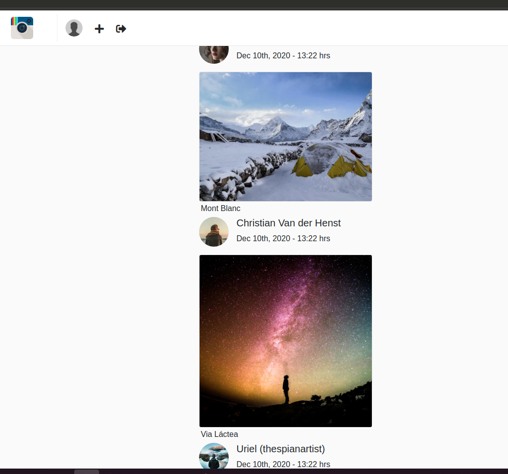


## Login y protegiendo vistas

Vamos a crear el login de nuestra aplicación, y este estará alojado en la aplicación de **users**. También protegeremos las vistas de **posts** para solo poder acceder a ellas cuando estemos iniciados.

Primero que todo llego la hora de poner **alias a las rutas** de nuestro proyecto, de esta forma podemos referenciar al alias en cualquier parte de nuestra aplicación sin preocuparnos si cambian el `path`, para esto iremos a `urls.py`.

```python
from django.contrib import admin
from django.conf import settings
from django.conf.urls.static import static
from django.urls import path

from platzigram import views as local_views
from posts import views as posts_views
from users import views as users_views

urlpatterns = [

    path('admin/', admin.site.urls),
    
    # A los path podemos asignarles valores a la variable name indicando un alias a la ruta
    path('hello-world/', local_views.hello_world, name='hello_world'),
    path('numbers/', local_views.numbers, name='sort'),
    path('hi/<str:name>/<int:age>/', local_views.say_hi, name='hi'),

    path('posts/', posts_views.list_posts, name='feed'),

    path('users/login/', users_views.login_view, name='login')

] + static(settings.MEDIA_URL, document_root=settings.MEDIA_ROOT)
```

En el archivo `users/views.py` vamos a renderizar el **login**.

```python
# Django
# Importamos authenticate y login
from django.contrib.auth import authenticate, login
# Redirect nos ayudara a redireccionarnos a otro path
from django.shortcuts import render, redirect

def login_view(request):
  if request.method == 'POST':
    username = request.POST['username']
    password = request.POST['password']
    # El metodo authenticate tratara de contrastar el usuario 
    # con una instancia del modelo users que creamos.
    user = authenticate(request, username=username, password=password)
    if user:
      # En caso de ser exitoso la autenticación creara 
      # un token de nuestro usuario para almacenarlo en memoria.
      login(request, user)
      # Y nos redireccionaremos al path con alias 'feed' que es 'posts/'
      return redirect('feed')
    else:
      # En caso de dar false la autenticacion volveremos a renderizar el login, 
      # pero enviando la variable 'error'
      return render(request, 'users/login.html', {'error': 'Invalid username and password'})
  return render(request, 'users/login.html')
```

En `templates/users` crearemos 2 archivos, **base.html** y **login.html**. La razón del porque ocuparemos un base distinto al anterior es por que a nivel de contenido son distintos.

```html
<!-- Archivo template/users/base.html -->
<!DOCTYPE html>
<html lang="en">
<head>
  <meta charset="UTF-8">
  

  
  <link rel="stylesheet" href="">
  <link rel="stylesheet" href="https://use.fontawesome.com/releases/v5.1.0/css/all.css" crossorigin="anonymous" />
  <link rel="stylesheet" href="" />

</head>
<body class="h-100">

  <div class="container h-100">
    <div class="row h-100 justify-content-center align-items-center">
      <div class="col-sm-12 col-md-5 col-lg-5 pt-2 pl-5 pr-5 pb-5" id="auth-container">

        

        

      </div>
    </div>
  </div>

</body>
</html>
```

Extendemos el templete base de user `template/users/base.html`.

```html
<!-- Archivo template/users/login.html -->



<title>Platzigram sign in</title>




<!-- Como anteriormente le dimos un alias al path 'users/login/' ahora lo invocaremos como 'login'. -->
<form method="POST" action="">

  <!-- En caso de que estemos recibiendo la variable 'error' en el renderizado lo mostraremos. -->
  
    <p style="color: red;">{{ error }}</p>
  

  <!-- csrf_token es un metodo de Django para evitar ataques CSRF. Te lo explico mejor abajo. -->
  

  <input type="text" placeholder="Username" name="username" />
  <input type="password" placeholder="Password" name="password" />

  <button type="submit">Sign in!</button>

</form>


```

Si observaste bien en el archivo `login.html` hacemos uso del tag `csrf_token` de Django. Este método evita un tipo de exploit malicioso llamado "Cross-site request forgery", el cual consiste en llenados de formularios desde fuera del sitio. La forma en la que trabaja _csrf_token_ es que cuando se realiza una petición 'GET' se te envía un token único, y cuando realizas el submit del formulario con un método 'POST' se va a revisar el token que conseguiste antes, de esta forma se evita el exploit.

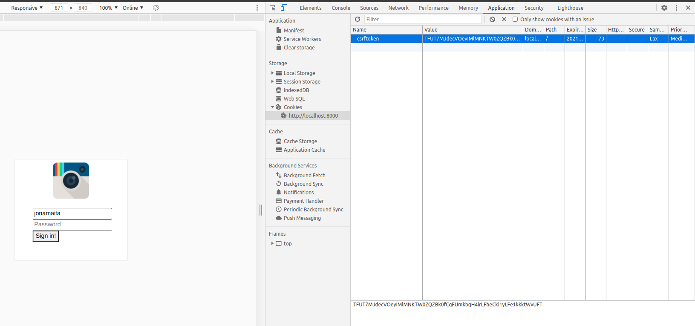


Ahora para **proteger** las vistas de _posts_ y que solo podamos acceder a ellas si hemos **iniciado sesión** vamos al archivo `settings.py` de nuestro proyecto y al fondo del código creamos la variable **LOGIN_URL** con el path de nuestro **login**, de esta forma nos redireccionará al path definido si tratamos de renderizar una vista protegida sin **registrarnos**.

```python
...
# Usamos el alias del path de login
LOGIN_URL = 'login'
```

Ahora para proteger las vistas debemos ir al archivo views.py de nuestra aplicación.

```python
# Django
# Importamos login_required
from django.contrib.auth.decorators import login_required
from django.shortcuts import render

...

# Decoramos con login_required la función que renderiza nuestra vista, 
# el cual ahora necesitara una sesión iniciada para poder renderizarse. 
# En caso de no estarlo nos redirigira al path de login.
@login_required
def list_posts(request):
  return render(request, 'posts/feed.html', {'posts': posts})
```

Ahora veamos las vistas protegidas en acción. Primero con un usuario **sin registrar.**

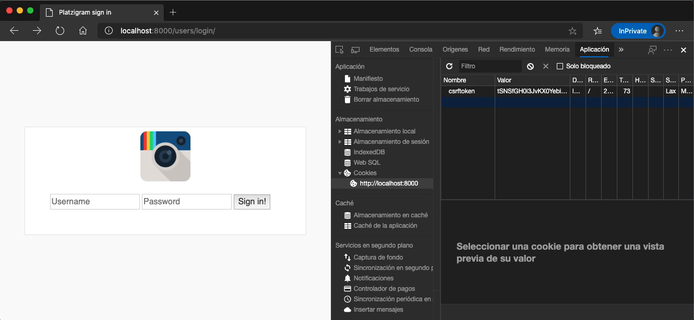

Luego con un usuario **registrado**.


## Logout

El proceso de **logout** es bastante sencillo en Django. Primero iremos a las vistas de nuestro aplicativo y crearemos una función para ello.

```python
# Archivo users/views.py
# Django
# Importamos logout.
from django.contrib.auth import authenticate, login, logout
from django.contrib.auth.decorators import login_required
from django.shortcuts import render, redirect

def login_view(request):
  if request.method == 'POST':
    username = request.POST['username']
    password = request.POST['password']
    user = authenticate(request, username=username, password=password)
    if user:
      login(request, user)
      return redirect('feed')
    else:
      return render(request, 'users/login.html', {'error': 'Invalid username and password'})
  return render(request, 'users/login.html')

# Creamos la funcion logout_view, y lo decoramos con
# login_required, asi solo se ejecutara si existe una sesión.
@login_required
def logout_view(request):
  logout(request) # Ejecutamos logout, el cual borrara los tokens del navegador.
  return redirect('login') # Redirigimos a path de login.
```

Luego de ello iremos a `platzigram/urls.py` de nuestro proyecto.

```python

...

urlpatterns = [
  ...
  # Creamos el path de logout.
  path('users/logout', users_views.logout_view, name='logout'),

] + static(settings.MEDIA_URL, document_root=settings.MEDIA_ROOT)
```

Y por terminar, en  `templates/nav.html` debemos referenciar al path de 'logout' con un botón para que nos haga el **logout**.

```html
<!-- templates/nav.html -->

<nav class="navbar navbar-expand-lg fixed-top" id="main-navbar">
  <div class="container">

    <a class="navbar-brand pr-5" style="border-right: 1px solid #efefef;" href="">
      <!-- Vamos a referenciar a la imagen de instagram en statics -->
      
    </a>

    <div class="collapse navbar-collapse">
      <ul class="navbar-nav mr-auto">

        <li class="nav-item">
          <a href="">
            <!-- Aqui referenciamos otra imagen -->
            
          </a>
        </li>

        <li class="nav-item nav-icon">
          <a href="">
            <i class="fas fa-plus"></i>
          </a>
        </li>
		<!-- Aqui referenciamos la url de logout -->
        <li class="nav-item nav-icon">
          <a href="">
            <i class="fas fa-sign-out-alt"></i>
          </a>
        </li>

      </ul>
    </div>
  </div>
</nav>
```

Listo, ahora tenemos un **logout** funcionando perfectamente de forma sencilla.

## Signup

Ahora aprenderemos a registrar un usuario y guardar un instancia de nuestro modelo **Profile.**

Primero crearemos un **template** para el registro, así que creamos el archivo `template/users/signup.html`

```html
<!-- Archivo template/users/signup.html -->




<title>Platzigram sign up</title>




  <!-- En caso de un error desplegaremos el mensaje aqui -->
  
    <p class="alert alert-danger">{{ error }}</p>
  

  <!-- Este sera el formulario de registro -->
  <form actions="" method="POST">
    <!-- No olvidar que para los formularios en Django debemos hacer uso de csrf_token -->
    

    <div class="form-group"><input type="text" class="form-control" placeholder="Username" name="username" required="true"></div>
    <div class="form-group"><input type="password" class="form-control" placeholder="Password" name="password" required="true"></div>
    <div class="form-group"><input type="password" class="form-control" placeholder="Password confirmation" name="password_confirmation" required="true"></div>
    <div class="form-group"><input type="text" class="form-control" placeholder="First name" name="first_name" required="true"></div>
    <div class="form-group"><input type="text" class="form-control" placeholder="Last name" name="last_name" required="true"></div>
    <div class="form-group"><input type="email" class="form-control" placeholder="Email address" name="email" required="true"></div>

    <button class="btn btn-primary btn-block mt-5" type="submit">Register!</button>

  </form>


```

Teniendo listo nuestro **template** ahora crearemos la función que renderizara nuestra vista. Para ello iremos a `users/views.py`.

```python
# Django
...
# Vamos hacer uso de render y redirect
from django.shortcuts import render, redirect

# Exceptions
# Importamos posible error al tratar de crear una instancia con valor único que ya existe
from django.db.utils import IntegrityError

# Models
# Importamos los modelos de las instancias que crearemos
from django.contrib.auth.models import User
from users.models import Profile

...

def signup(request):
  # Al recibir el metodo POST.
  if request.method == 'POST':
    username = request.POST['username']
    password = request.POST['password']
    password_confirmation = request.POST['password_confirmation']

    # Confirmamos que las constraseñas sean iguales.
    if password != password_confirmation:
      # En caso de error volvemos a renderizar signup, pero enviamos el error.
      return render(request, 'users/signup.html', {'error': 'Passwords does not match'})

    try:
      # Creamos una instancia de User
      user = User.objects.create_user(username=username, password=password)
    except IntegrityError:
      # En caso que username (nuestro valor unico) ya exista renderizara
      # nuevamente signup pero enviando el error.
      return render(request, 'users/signup.html', {'error': 'Username is already exist'})
    # Ya creada la instancia le pasamos los siguientes valores.
    user.first_name = request.POST['first_name']
    user.last_name = request.POST['last_name']
    user.email = request.POST['email']
    # Lo guardamos en nuestra base de datos.
    user.save()

    # Creamos nuestra instacia de Profile a traves de user.
    profile = Profile(user=user)
    # Lo guardamos en la base de datos.
    profile.save()

    # Nos redirigimos a login para iniciar sesion con el nuevo usuario.
    return redirect('login')

  return render(request, 'users/signup.html')

...
```

Ahora nos faltaría solo asignar un path a nuestro signup, lo configuraremos en _urls.py_

```python
...

urlpatterns = [
  ...
  
  path('users/signup', users_views.signup, name='signup'),

] + static(settings.MEDIA_URL, document_root=settings.MEDIA_ROOT)

...
```

## Middlewares

El término **middleware** se refiere a un sistema de software que ofrece servicios y funciones comunes para las aplicaciones. En general, el middleware se encarga de las tareas de gestión de datos, servicios de aplicaciones, mensajería, autenticación y gestión de API.

Django define como un middleware una serie de hooks y una API de bajo nivel que nos permiten modificar el objeto request antes de que llegue a la vista y tambien nos permite modificar el objeto response antes de que salga de la vista.

Django dispone de los siguientes middlewares por defecto:

- SecurityMiddleware: Se encarga de comprobar todas las medidas de seguridad, las variables de settings relacionadas con Https, Auth, entre otros.
- SessionMiddleware: Se encarga de validar una sesión.
- CommonMiddleware: Se encarga de verificar componentes comunes como lo es el debug.
- CsrfViewMiddleware: Se encarga de toda la validación correspondiente a CSRF. Éste nos permite utilizar el tag  y es el que inserta el token de seguridad en cada formulario.
- AuthenticationMiddleware: Nos permite agregar request.user desde las vistas.
- MessageMiddleware: Pertenece al Framework de mensajes de Django, y permite pasar un mensaje sin necesidad de mantener un estado en la base de datos o en memoria.
- XFrameOptionsMiddleware: Middleware de seguridad.

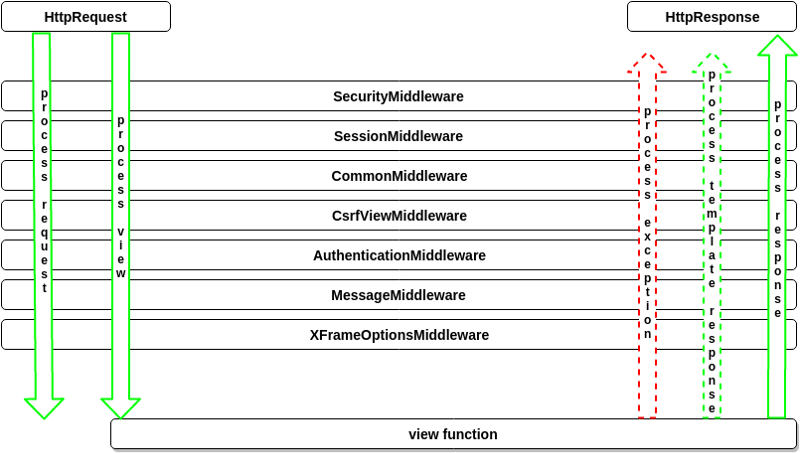

En este apartado aprenderemos como crear nuestro propio **middleware**, este **no** permitirá la navegación en la aplicación si es que el usuario **no tiene fotografia o biografía.**

Primero crearemos un template del perfil donde el usuario podrá modificar su información. Este template sera simple por el momento y estará en `templates/users/update_profile.html`.

```html
<!-- Archivo templates/users/update_profile.html -->



<title>@{{ request.user.username }} | Update profile</title>



  <h1 class="mt-5">@{{ request.user.username }}</h1>

```

Ahora en nuestro archivo `users/views.py` vamos a crear la función o vista que renderizará el template recién creado.

```python
...

def update_profile(request):
  return render(request, 'users/update_profile.html')

...
```

Luego de definir nuestra vista vamos asignarle un path dentro del archivo `platzigram/urls.py`.

```python
...

urlpatterns = [
  ...
  
  path('users/me/profile', users_views.update_profile, name='update_profile'),

] + static(settings.MEDIA_URL, document_root=settings.MEDIA_ROOT)
```

Llego el momento esperado, es hora de crear nuestro **middleware**. Por lo general los middleware se crean en la aplicación relacionada, pero **solo para efectos prácticos** crearemos el nuestro en la carpeta principal de nuestro proyecto ( `platzigram`) como **middleware.py**.

```
├── db.sqlite3
├── manage.py
├── platzigram
│   ├── asgi.py
│   ├── __init__.py
│   ├── middleware.py <------- middleware comunes para las app ---
│   ├── settings.py
│   ├── urls.py
│   ├── views.py
│   └── wsgi.py
├── posts
│   ├── admin.py
│   ├── apps.py
│   ├── __init__.py
│   ├── models.py
│   ├── tests.py
│   └── views.py
├── README.md
├── requirements.txt
├── static
│   ├── css
│   │   ├── bootstrap.min.css
│   │   └── main.css
│   └── img
│       ├── default-profile.png
│       └── instagram.png
├── templates
│   ├── base.html
│   ├── nav.html
│   ├── posts
│   │   └── feed.html
│   └── users
│       ├── base.html
│       ├── login.html
│       ├── signup.html
│       └── update_profile.html
└── users
    ├── admin.py
    ├── apps.py
    ├── __init__.py
    ├── models.py
    ├── tests.py
```


El **objetivo** de nuestro middleware es evitar que se pueda navegar por la aplicación si es que el usuario no tiene foto de perfil o no ha escrito su biografía, por lo que nuestro middleware contendrá una clase que realizara todas estas validaciones.

```python
# Django
# Para nuestro objetivo ocuparemos redirect para que el usuario
# se dirija a la configuración en caso de no cumplir con los requisitos.
from django.shortcuts import redirect
# Usaremos reverse para hacer referencia al alias
# de los path de nuestro proyecto.
from django.urls import reverse

class ProfileCompletionMiddleware:
  # Este __init__ siempre ira, asi que es fundamental al crear tu clase
  def __init__(self, get_response):
    self.get_response = get_response

  # Dentro de __call__ es donde realizaremos nuestras validaciones.
  def __call__(self, request):
    # En caso de que el usuario no sea anonimo.
    if not request.user.is_anonymous:
      profile = request.user.profile
      
      # Verificamos que la instacia de user tenga
      # una foto o biografía.
      if not profile.picture or not profile.biography:
        # En caso de que no trate de navegar al path de
        # 'update_profile' o 'logout'
        if request.path not in [reverse('update_profile'), reverse('logout')]:
          # Vamos a redireccionarlo al path de 'update_profile'
          return redirect('update_profile')

    # En caso de que cumple todos los requisitos devolvemos la solicitud original.
    response = self.get_response(request)
    return response
```

Nos falta un paso mas, tenemos que decirle a nuestro proyecto que ahora también debe usar este middleware para las peticiones. Para ello iremos al archivo `settings.py` y lo incluiremos en la variable de **MIDDLEWARE.**

```python
MIDDLEWARE = [
    # Django
    'django.middleware.security.SecurityMiddleware',
    'django.contrib.sessions.middleware.SessionMiddleware',
    'django.middleware.common.CommonMiddleware',
    'django.middleware.csrf.CsrfViewMiddleware',
    'django.contrib.auth.middleware.AuthenticationMiddleware',
    'django.contrib.messages.middleware.MessageMiddleware',
    'django.middleware.clickjacking.XFrameOptionsMiddleware',
    # Propios
    # Referenciamos al middleware por el nombre de la clase
    'platzigram.middleware.ProfileCompletionMiddleware',
]
```

Y con esto ya creamos nuestro primer middleware.

# Forms

## Formularios en Django

En esta sección veremos en acción los **forms** en Django. Primero que todo crearemos nuestro form en `templates/users/update_profile.html` creado en la sección de [middlewares](#Middlewares).

> En los siguientes link podemos encontrar mas documentación sobre los formularios y fields.
>
> https://docs.djangoproject.com/en/3.1/topics/forms/
>
> https://docs.djangoproject.com/en/3.1/ref/forms/fields/

```html
<!-- templates/users/update_profile.html -->




<title>@{{ request.user.username }} | Update profile</title>




<div class="container">

  <div class="row justify-content-md-center">
    <div class="col-6 p-4" id="profile-box">

      <!-- Utilizaremos enctype="multipart/form-data" para referirnos a que existiran varios tipos de datos en nuestro metodo POST -->
      <form action="" method="POST" enctype="multipart/form-data">
        

        
          <p>{{ form.errors }}</p>
        

        <div class="media">
          
            
          
            
          

          <div class="media-body">
            <h5 class="ml-4">@{{ user.username }} | {{ user.get_full_name }}</h5>
            <p class="ml-4"><input type="file" name="picture" required="true"></p>
          </div>
        </div>

        <hr><br>

        <div class="form-group">
          <label>Website</label>
          <input
            class="form-control"
            type="url"
            name="website"
            placeholder="Website"
            value="{{ profile.website }}"
          />
        </div>

        <div class="form-group">
          <label>Biography</label>
          <textarea class="form-control" name="biography">{{ profile.biography }}</textarea>
        </div>

        <div class="form-group">
          <label>Phone number</label>
          <input
            class="form-control"
            type="text"
            name="phone_number"
            placeholder="Phone number"
            value="{{ profile.phone_number }}"
          />
        </div>

        <button type="submit" class="btn btn-primary btn-block mt-5">Update info</button>
      </form>
    </div>
  </div>
</div>


```

**Django** ya incorpora una **clase forms** del cual podemos hacer uso, así que crearemos nuestra clase forms para crear un formulario de usuario.

```python
# Django
from django import forms

class ProfileForm(forms.Form):

  website = forms.URLField(max_length=200, required=True)
  biography = forms.CharField(max_length=500, required=False)
  phone_number = forms.CharField(max_length=20, required=False)
  picture = forms.ImageField()

```

En la documentación podrás encontrar como trabajar con [formularios](https://docs.djangoproject.com/en/3.0/topics/forms/) y los [campos](https://docs.djangoproject.com/en/3.0/ref/forms/fields/) que puedes usar

Para poder recibir los datos y guardarlos en nuestra base de datos vamos a ir a nuestra vista de la aplicación _users/**views.py**_ en donde crearemos la función que se encargara de ello.

```python
# Archivo users/views.py
...

# Forms
# Importamos el ProfileForm que creamos anteriormente
from users.forms import ProfileForm

# En la vista de update_profile vamos a recibir el request.
@login_required
def update_profile(request):
    """
    Update a user's profile view
    """
    # Crearemos una variable que guardara el profile
    # que esta realizando el request.
    profile = request.user.profile

    # Si el request es de tipo 'POST'
    if request.method == 'POST':

        # Crearemos una instancia de ProfileForm
        # con los datos que recibimos a traves de request
        form = ProfileForm(request.POST, request.FILES)

        # Si la instacia se crea sin problemas.
        if form.is_valid():

            # Guardaremos los datos recibidos en base de datos.
            data = form.cleaned_data

            profile.website = data['website']
            profile.phone_number = data['phone_number']
            profile.biography = data['biography']
            if data["picture"]:
                profile.picture = data["picture"]
            profile.save()

            # Y redireccionaremos a la pagina update_profile
            # para reflejar los cambios.
            return redirect('update_profile')
    else:
        form = ProfileForm()

    return render(
        request=request,
        template_name='users/update_profile.html',

        # Enviaremos al template los datos del usuario.
        context={
            'profile': profile,
            'user': request.user,
            'form': form,
        }
    )

...
```

Terminados estos pasos podremos ver nuestro profile con los datos de nuestro usuario y actualizarlos, preservando los datos.

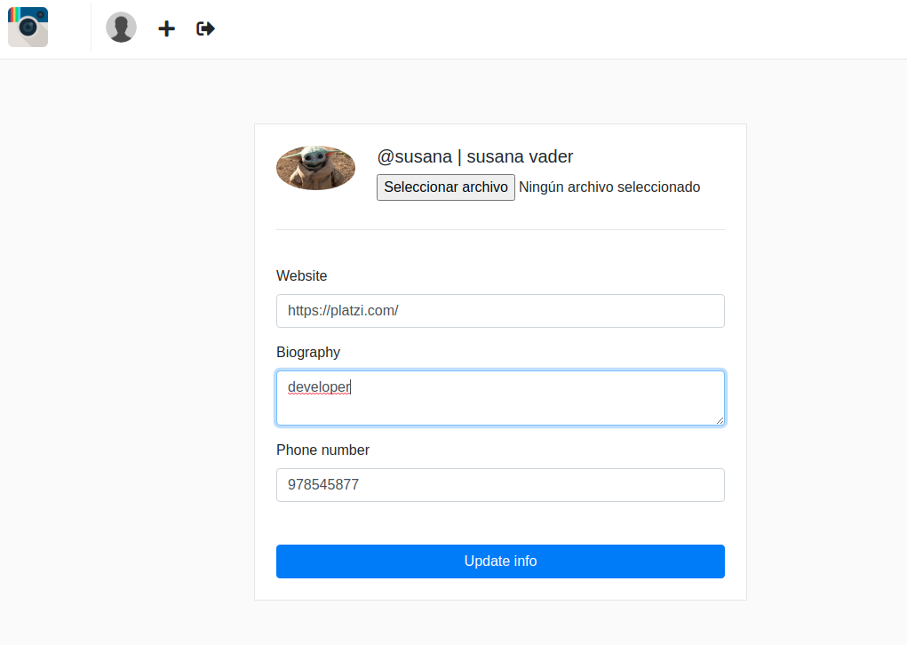

En caso de que algún dato no cumpla con los requisitos establecidos en la clase form desplegaremos en pantalla los errores que tengamos.

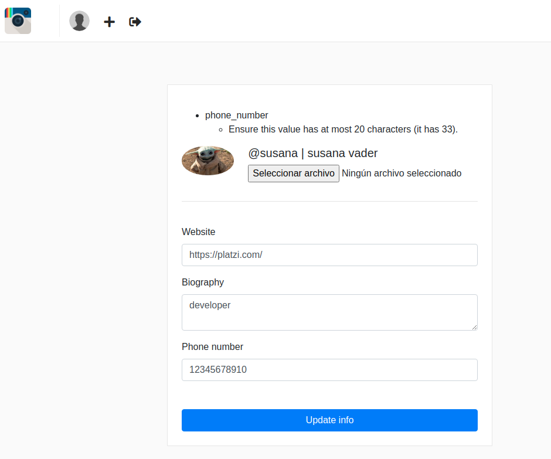


## Mostrando el form en el template

Si te diste cuenta en la sección anterior, si enviamos campos inválidos estos vuelven con el valor anterior que tenian. En esta sección haremos persistentes estos datos.

Para ello solo tendremos que modificar nuestro `template/update_profile.html`.

```html




<title>@{{ request.user.username }} | Update profile</title>




<div class="container">

  <div class="row justify-content-md-center">
    <div class="col-6 p-4" id="profile-box">

      <!-- Utilizaremos enctype="multipart/form-data" para referirnos a que existiran varios tipos de datos en nuestro metodo POST -->
      <form action="" method="POST" enctype="multipart/form-data">
        

        

        <div class="media">
            
                
            
                
            

            <div class="media-body">
                <h5 class="ml-4">@{{ user.username }} | {{ user.get_full_name }}</h5>
                <p class="ml-4"><input type="file" name="picture"></p>
            </div>
        </div>

        <!-- En caso de error con la imagen mostraremos un alert con el error -->
        
        <div class="alert alert-danger">
            <b>Picture: </b>{{ error }}
        </div>
        

        <hr><br>

        <div class="form-group">
            <label>Website</label>
            <!-- Si hay un error le asignamos la clase is-invalid de bootstrap, y en value persistimos el dato-->
            <input
                class="form-control is-invalid"
                type="text"
                name="website"
                placeholder="Website"
                value="{{ form.website.value }}{{ profile.website }}"
            />
            <!-- Mostramos el error -->
            <div class="invalid-feedback">
                
                    {{ error }}
                
            </div>
        </div>

        <div class="form-group">
            <label>Biography</label>
            <!-- Si hay un error le asignamos la clase is-invalid de bootstrap, y en value persistimos el dato-->
            <textarea 
                class="form-control form-control is-invalid"
                name="biography"
            >{{ form.biography.value }}{{ profile.biography }}</textarea>
            <!-- Mostramos el error -->
            <div class="invalid-feedback">
                
                    {{ error }}
                
            </div>
        </div>

        <div class="form-group">
            <label>Phone number</label>
            <!-- Si hay un error le asignamos a clase is-invalid de bootstrap, y en value persistimos el dato-->
            <input
                class="form-control form-control is-invalid"
                type="text"
                name="phone_number"
                placeholder="Phone number"
                value="{{ form.phone_number.value }}{{ profile.phone_number }}"
            />
            <!-- Mostramos el error -->
            <div class="invalid-feedback">
                
                    {{ error }}
                
            </div>
        </div>

        <button type="submit" class="btn btn-primary btn-block mt-5">Update info</button>
      </form>
    </div>
  </div>
</div>


```

Con esto estos cambios ahora los valores ingresados **persistiran** en nuestro formulario sin importar si existe un error, ademas de mostrarlos de forma estilizadas.

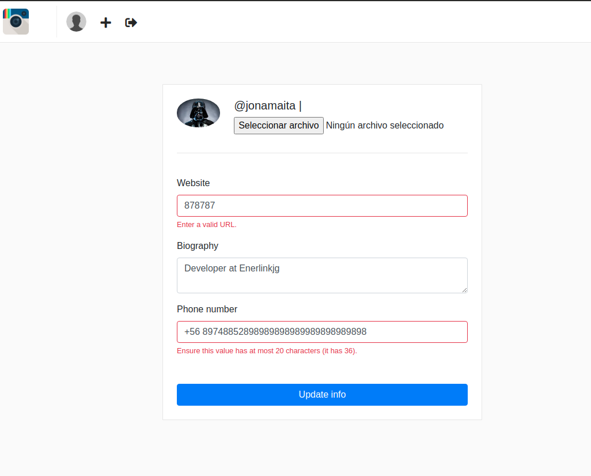

## Models forms 

ModelForm es una manera más sencilla de crear formularios en Django y en el caso de nuestro proyecto, se adapta mucho mejor al modelo que ya tenemos.
Lo usaremos para crear el formulario de posts. Es decir, crearemos formulario a partir de nuestro modelo.

Primero creamos un archivo `forms.py` en la aplicación `posts`, en este archivo declararemos nuestro formulario para realizar nuevos **posts**.

```python
# posts/forms.py
"""Post forms."""
# Django
from django import forms

# Models
from posts.models import Post


class PostForm(forms.ModelForm):
    """Post model form."""

    class Meta:
        """Form settings."""

        model = Post
        fields = ('title', 'photo')
```

Con esto ya tenemos nuestro formulario a partir del modelo `Post`, para crear un nuevo **post**, ahora tenemos que definir la vista para crear un **post** a partir del **form** antes realizado

```python
# posts/views.py

.....
@login_required
def create_post(request):
    """Create new post view."""

    if request.method == 'POST':
        form = PostForm(request.POST, request.FILES)
        if form.is_valid():
            form.instance.user = request.user
            form.instance.profile = request.user.profile
            form.save()
            return redirect('feed')

    else:
        form = PostForm()

    return render(
        request=request,
        template_name='posts/new.html',
        context={
            'form': form,
            'user': request.user,
            'profile': request.user.profile
        }
    )
.....
```

Ahora debemos declarar la url para la vista `create_post` y aprovecharemos de modificar la url para `list_posts`.

```python
# platzigram/urls.py

from django.conf import settings
from django.conf.urls.static import static
from django.contrib import admin
from django.urls import path

from platzigram import views as locals_views
from posts import views as posts_views
from users import views as users_views

urlpatterns = [
    path("admin/", admin.site.urls),
    path("hello-world/", locals_views.hello_world, name="hello_world"),
    path("sorted/", locals_views.sorted_numbers, name="sort"),
    path("hi/<str:name>/<int:age>", locals_views.say_hi, name="hi"),
    path("", posts_views.list_posts, name="feed"),
    path("posts/new/", posts_views.create_post, name="create_post"),
    path("users/login", users_views.login_view, name="login"),
    path("users/logout", users_views.logout_view, name="logout"),
    path("users/signup", users_views.signup, name="signup"),
    path(
        "users/me/profile", users_views.update_profile, name="update_profile"
    ),

    # concatenamos static con los valores definidos en settings.py
] + static(settings.MEDIA_URL, document_root=settings.MEDIA_ROOT)
```

Ahora debemos crear nuestro template `templates/posts/new.html` para crear un nuevo formulario.

```html
<!------ templates/posts/new.html ---->



<title>Create new post</title>




    <div class="container">
        <div class="row justify-content-md-center">
            <div class="col-6 pt-3 pb-3" id="profile-box">
                <h4 class="mb-4">Post a new photo!</h4>

                <form method="POST" enctype="multipart/form-data">
                    

                    {# Website field #}
                    <div class="form-group">
                        <input
                            class="form-control is-invalid"
                            type="text"
                            name="title"
                            placeholder="Title"
                        >
                        <div class="invalid-feedback">
                            {{ error }}
                        </div>
                    </div>

                    {# Photo field #}
                    <div class="form-group">
                        <label>Choose your photo:</label>
                        <input
                            class="form-control is-invalid"
                            type="file"
                            name="photo"
                            placeholder="photo"
                        >
                        <div class="invalid-feedback">
                            {{ error }}
                        </div>
                    </div>

                    <button type="submit" class="btn btn-primary btn-block mt-5">Publish!</button>
                </form>
            </div>
        </div>
    </div>


```

Aprovecharemos para refinar la funcionalidad en el navbar y conectar el feed con los posts.

```html
<!--- templates/nav.html ---
<!-- Cargamos las refenrencias a los dir static -->

<nav class="navbar navbar-expand-lg fixed-top" id="main-navbar">
  <div class="container">

    <a class="navbar-brand pr-5" style="border-right: 1px solid #efefef;" href="">
      <!-- Vamos a referenciar a la imagen de instagram en statics -->
      
    </a>

    <div class="collapse navbar-collapse">
      <ul class="navbar-nav mr-auto">

          <li class="nav-item">
            <a href="">
                
                    
                
                    
                
            </a>
        </li>

        <li class="nav-item nav-icon">
            <a href="">
                <i class="fas fa-plus"></i>
            </a>
        </li>

        <li class="nav-item nav-icon">
          <a href="">
            <i class="fas fa-sign-out-alt"></i>
          </a>
        </li>

      </ul>
    </div>
  </div>
</nav>
```

Ahora modificamos la vista `list_posts` para que nuestro feed sea dinámico.

```python
# posts/views.py
...

# Models
from posts.models import Post

# Create your views here.

@login_required
def list_posts(request):  # pylint: disable = unused-argument
    """
    View to lists posts
    """
    posts = Post.objects.all().order_by('-created')

    return render(request, 'posts/feed.html', {'posts': posts})
...
```

Ahora debemos  modificar el template `feed.html`.

```html
<!--- templates/posts/feed.html ----

<!-- Extendemos este template de nuestro archivo templates/base.html -->


<!-- Definimos el contenido del head en el bloque head_content -->

<title>Platzigram feed</title>


<!-- Desplegamos el contenido de nuestro template en el bloque container definido del archivo que se extiende -->

<div class="container">
  <div class="row">

      
      <div class="col-sm-12 col-md-8 offset-md-2 mt-5 p-0 post-container">
          <div class="media pt-3 pl-3 pb-1">
              
              <div class="media-body">
                  <p style="margin-top: 5px;">{{ post.user.get_full_name  }}</p>
              </div>
          </div>

          

          <p class="mt-1 ml-2" >
              <a href="" style="color: #000; font-size: 20px;">
                  <i class="far fa-heart"></i>
              </a> 30 likes
          </p>
          <p class="ml-2 mt-0 mb-2">
              <b>{{ post.title }}</b> - <small>{{ post.created }}</small>
          </p>
      </div>
      
  </div>
</div>

```


## Validación de formulario en el Model Form

Hasta ahora hemos estado validando los datos a través en las vistas y eventualmente el código puede convertirse en un caos, sin embargo, podemos validar directamente sobre los formularios los datos, simplificando la sintaxis de nuestro código y haciéndolo mas legible.

Para ello primero crearemos un archivo **forms.py** en nuestra aplicación _users_.

```python
# users/forms.py
"""
Users forms
"""
from django import forms

# Models
from django.contrib.auth.models import User
from users.models import Profile


class SignupForm(forms.Form):
    """
    Signup Form
    """

    # Definimos los campos.
    username = forms.CharField(min_length=4, max_length=50)

    password = forms.CharField(max_length=70, widget=forms.PasswordInput())
    password_confirmation = forms.CharField(
        max_length=70,
        widget=forms.PasswordInput(),
    )

    first_name = forms.CharField(min_length=2, max_length=50)
    last_name = forms.CharField(min_length=2, max_length=50)

    email = forms.CharField(
        min_length=6,
        max_length=70,
        widget=forms.EmailInput(),
    )

    # verificamos que el username no exista. El nombre de la clase debe ser
    # clean_<field>, en este caso el field es username
    def clean_username(self):
        """Username must be unique."""
        username = self.cleaned_data['username']
        username_taken = User.objects.filter(username=username).exists()
        if username_taken:
            #  En caso de existir devolvemos un mensaje de error al html.
            raise forms.ValidationError('Username is already in use.')
        # Siempre debemos retornar el campo
        return username

    # Sobreescribimos el método clean
    def clean(self):
        # Llamamos el método .clean de la clase padre
        data = super().clean()

        password = data['password']
        password_confirmation = data['password_confirmation']

        # Verificamos que las constraseñas coincidan.
        if password != password_confirmation:
            # En caso de ser distintas devolvemos un mensaje de error al html.
            raise forms.ValidationError('Passwords do not match.')

        # siempre debemos retornar el data
        return data

    # Creamos una instancia de User y Profile.
    def save(self):
        """
        save method.
        """
        data = self.cleaned_data
        data.pop('password_confirmation')

        # creamos el objeto user
        user = User.objects.create_user(**data)
        profile = Profile(user=user)
        profile.save()


class ProfileForm(forms.Form):
    """
    Update profile form
    """
    website = forms.URLField(max_length=200, required=True)
    biography = forms.CharField(max_length=500, required=False)
    phone_number = forms.CharField(max_length=20, required=False)
    picture = forms.ImageField(required=False)
```

Ya que tenemos nuestro formulario creado lo aplicaremos en la vista de **signup** de la aplicación _users_.

```python
# Django
...
from django.shortcuts import render, redirect

...

# Forms
# Importamos nuestro formulario
from users.forms import SignupForm


def signup(request):
  if request.method == 'POST':
    # Le enviamos los datos de request a nuestro formulario
    form = SignupForm(request.POST)
    
    # En caso de ser valido guarda las instancias
    # y nos redirige al login.
    if form.is_valid():
      form.save()
      return redirect('login')
  
  else:
    form = SignupForm()

  return render(
    request=request,
    template_name='users/signup.html',
    context={
      'form': form
    }
  )

...
```

Con esta metodología hacemos uso de las herramientas de Django para crear formularios, facilitando el desarrollo y sintaxis de nuestro proyecto.


Documentación:

[Widgets | Django documentation | Django](https://docs.djangoproject.com/en/2.0/ref/forms/widgets/)

[Form fields | Django documentation | Django](https://docs.djangoproject.com/en/2.0/ref/forms/fields/)

[Form and field validation | Django documentation | Django](https://docs.djangoproject.com/en/2.0/ref/forms/validation/)

# Vistas basadas en clases

Veamos de qué forma optimizamos el proceso de creación de nuestras apps de forma que no repitamos código. Para ver cuál es el concepto de class based views. Las vistas también pueden ser clases, que tienen el objetivo de evitar la repetición de tareas como mostrar los templates, son vistas genéricas que resuelven problemas comunes.

Primero debemos modificar `urls.py` de `platzigram` (urls principales), ya que, con lo siguiente vamos ordenar las url de mejor manera, es decir, un ruta para cada aplicación, ademas a cada aplicación le vamos a crear un archivo `urls.py`, el cual, tendrá las urls de esa aplicación.

```python
# platzigram/urls.py
from django.conf import settings
from django.conf.urls.static import static
from django.contrib import admin
from django.urls import path, include


urlpatterns = [
    path("admin/", admin.site.urls),
    path("", include(("posts.urls", "posts"), namespace="posts")),
    path("users/", include(("users.urls", "users"), namespace="users")),

    # concatenamos static con los valores definidos en settings.py
] + static(settings.MEDIA_URL, document_root=settings.MEDIA_ROOT)

```

Ahora creamos un archivo `urls.py` para cada aplicación.

```python
# users/urls.py

"""Users URLs."""

# Django
from django.urls import path
from django.views.generic import TemplateView

# View
from users import views


urlpatterns = [

    # Posts
    path(
        route='profile/<str:username>/',
        view=TemplateView.as_view(template_name='users/detail.html'),
        name='detail'
    ),

    # Management
    path(
        route='login/',
        view=views.login_view,
        name='login'
    ),
    path(
        route='logout/',
        view=views.logout_view,
        name='logout'
    ),
    path(
        route='signup/',
        view=views.signup,
        name='signup'
    ),
    path(
        route='me/profile/',
        view=views.update_profile,
        name='update_profile'
    )

]

```

```python
# posts/urls.py

"""Posts URLs."""

# Django
from django.urls import path

# Views
from posts import views

urlpatterns = [

    path(
        route='',
        view=views.list_posts,
        name='feed'
    ),

    path(
        route='posts/new/',
        view=views.create_post,
        name='create'
    ),
]
```

habiendo ordenado las `urls` por cada aplicación, debemos modificar varios archivos, ya que, cuando hagamos referencia a la **url** en la vista o en el html debemos referenciarlo de la siguiente manera:

`<nombre_app>:<nombre_url>` 

Ejemplo:

`user:login`

Esto se debe hacer en todos lo archivos en donde hacemos referencia a las **urls**, en el siguiente ejemplo podemos ver como refereciamos la url en la vista `login_view`, al redireccionar a la url `posts:feed`.

```python
def login_view(request):
    """
    login view
    """

    if request.method == "POST":
        username = request.POST["username"]
        password = request.POST["password"]
        # El metodo authenticate tratara de contrastar el usuario con una
        # instancia del modelo users que creamos.
        user = authenticate(request, username=username, password=password)
        if user:
            # En caso de ser exitoso la autenticación creara un token de
            # nuestro usuario para almacenarlo en memoria.
            login(request, user)

            # redireccionaremos al path con alias 'feed' que es para la url
            # 'posts/'
            return redirect("posts:feed")

        # En caso de dar false la autenticacion volveremos a renderizar el
        # login, pero enviando la variable 'error'.
        return render(
            request,
            "users/login.html",
            {"error": "Invalid username and password"},
        )

    return render(request, "users/login.html")
```

Los otros documentos modificados estarán en el repositorio.

Documentación:

En el siguiente link nos podemos guiar para las vistas basadas en clases http://ccbv.co.uk/.

# Glosario

- **ORM**: Object-relational mapping. Es el encargado de permitir
  el acceso y control de una base de datos relacional a través de
  una abstracción a clases y objetos.
- **Templates**: Archivos HTML que permiten la inclusión y ejecución
  de lógica especial para la presentación de datos.
- **Modelo**: Parte de un proyecto de Django que se encarga de estructurar
  las tablas y propiedades de la base de datos a través de clases de Python.
- **Vista**: Parte de un proyecto de Django que se encarga de la
  lógica de negocio y es la conexión entre el template y el modelo.
- **App**: Conjunto de código que se encarga de resolver una parte
  muy específica del proyecto, contiene sus modelos, vistas, urls, etc.
- **Patrón de diseño**: Solución común a un problema particular.

