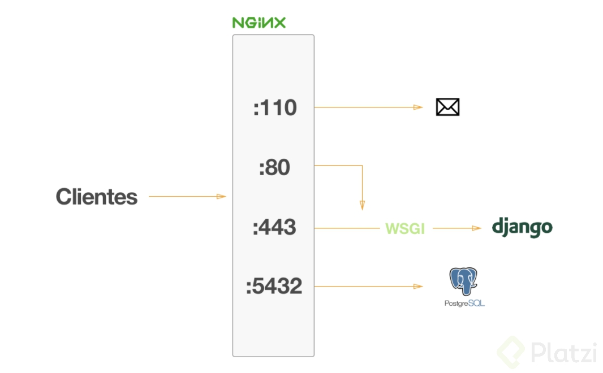
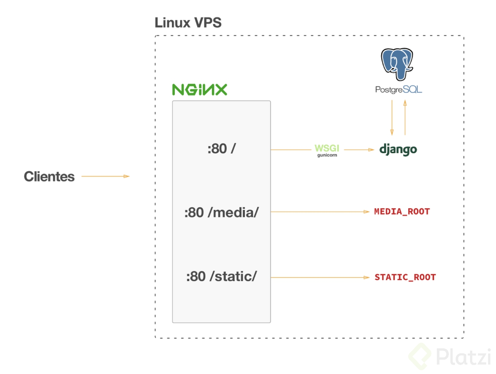
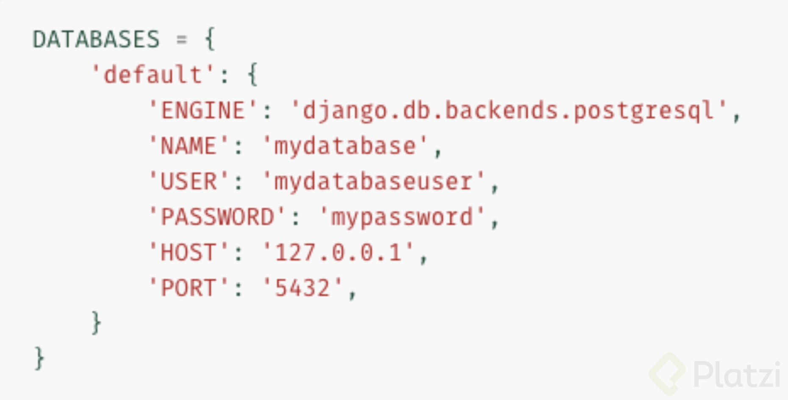
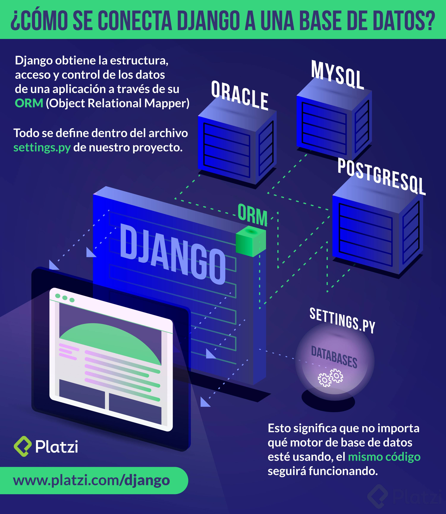

# Arquirectura / Conceptos / Componentes

Liberar un proyecto de Django a producción es una tarea bastante sencilla pero que puede confundir a muchos la primera vez que se intente (a mi me sucedió). El objetivo de esta lectura es tener una breve a introducción a la arquitectura de un proyecto de Django corriendo en un servidor de producción (un servidor de verdad) y que consecuentemente los siguientes tutoriales de configuración tengan más sentido al momento de que los leas.

Al principio del curso hablamos de un archivo llamado [wsgi.py](http://wsgi.py/) ubicado dentro del folder de las configuraciones del proyecto, conviviendo junto con el archivo [urls.py](http://urls.py/) y [settings.py](http://settings.py/). WSGI significa Web Server Gateway Interface y es un protocolo sencillo de llamadas para que un web server (como NGINX o Apache) se comuniquen con una aplicación web o framework escritos en Python.

WSGI nos permite delegar el trabajo de aplicar reglas complejas de enrutamiento a un web server como NGINX y al mismo tiempo lograr que exista una comunicación del usuario final de nuestro proyecto de Python. Dicho esto, esta sería la ilustración de un servidor que expone múltiples servicios como e-mail a través de pop3, un app server usando SSL, otro app server redirigiendo las peticiones HTTP a HTTPS y una base de datos de PostgreSQL:



Para el caso particular del proyecto del curso, nosotros usaremos un servidor Linux corriendo Ubuntu 16.04 en el cual configuraremos una base de datos de PostgreSQL, un web server NGINX y correremos nuestro proyecto de Django usando Gunicorn. Los archivos estáticos y subidos por los usuarios serán también servidos usando NGINX ya que no es trabajo de Django realizar estas tareas. La base de datos no tiene que estar disponible para el público por lo que no hay necesidad de que NGINX la exponga.



# ¿Cómo conectar Django a una base de datos?

Django obtiene la estructura, acceso y control de los datos de una aplicación a través de su ORM (Object Relational Mapper), esto significa que no importa qué motor de base de datos esté usando, el mismo código seguirá funcionando, configurar esto en un proyecto de Django es cuestión de segundos.

Todo se define dentro del archivo [settings.py](http://settings.py/) de nuestro proyecto dentro de la variable DATABASES:

DATABASE

Será el nodo padre que nos servirá para indicar que definiremos una base de datos.
Dentro, tendremos el nodo default este tendrá toda la configuración clave de la base de datos.



Además, Django puede trabajar con múltiples bases de datos usando una estrategia llamada routers por lo que el diccionario DATABASES puede contener múltiples llaves con diferentes bases de datos. Pero eso sí, necesita siempre existir una llave “default”.

Es un diccionario de python el cual requiere definir una base de datos por default, más de eso al final, usando la llave `default` que a su vez será otro diccionario con los datos de configuración:

La configuración recibirá el engine el cual puede ser:

PostgreSQL: 'django.db.backends.postgresql’
MySQL: 'django.db.backends.mysql’
SQLite: 'django.db.backends.sqlite3’
Oracle: 'Django.db.backends.oracle’
El nombre de la base de datos “NAME”.
El usuario “USER”.
La contraseña “PASSWORD”.
La ubicación o host del servidor de la base de datos “HOST”.
Y el puerto de conexión “PORT”.

Adicionalmente, se pueden configurar más detalles por base de datos, por ejemplo, configurar que todos los queries de una vista sean empaquetados en una sola transacción a la base de datos usando ATOMIC_REQUESTS=True.



# Configurar el servidor

Es una buena práctica al conectarnos por primera vez a nuestro servidor **actualizar los paquetes del Sistema Operativo** con los siguientes comandos:

```
sudo apt-get update && sudo apt-get upgrade
```

## Configuración inicial del servidor

1. Creamos un nuevo usuario sin *directorio home* que tenga la capacidad de correr algunos comandos de súper usuario:

```
sudo useradd -g sudo -M <username>
```

1. Le asignamos una contraseña segura al nuevo usuario:

```
sudo passwd <username>
```

1. Iniciamos sesión con el nuevo usuario:

```
su <username>
```

1. Por último vamos a instalar las dependencias de **python, postgress, git y nginix** con el siguiente comando:

```
sudo apt-get install python3-pip python3-dev postgresql postgresql-contrib libpq-dev git nginx
```

## Configurar PostgreSQL

Primero iniciamos sesión con el usuario **postgres** usando el comando `sudo su postgres` y después escribimos `psql` para entrar al **shell interactivo de PostgreSQL** donde configuramos lo siguiente:

1. Creamos una base de datos: `CREATE DATABASE platzi;`
2. Creamos un usuario para la base de datos: `CREATE USER freddier WITH PASSWORD ‘cvander<3’;`
3. Le damos permisos al usuario sobre la base de datos: `GRANT ALL PRIVILEGES ON DATABASE platzi TO freddier;`

Hecho esto, salimos del shell escribiendo `\q` seguido de `exit` para salir de la sesión de postgres.

## Configurar el proyecto

1. Clonar el proyecto de Github:

```
git clone [https://github.com/pablotrinidad/platzigram.git](https://github.com/pablotrinidad/platzigram.git) platzi
```

1. Instalar virtualenv:

```
sudo pip3 install virtualenv
```

1. Crear entorno virtual:

```
virtualenv -p $(which python3) .venv
```

1. Activar entorno virtual:

```
source .venv/bin/activate
```

1. Instalar dependencias para Pillow:

```
sudo apt-get install libjpeg-dev
```

1. Ir al folder del proyecto:

```
cd platzi
```

1. Instalar dependencias de python del proyecto:

```
pip install -r requirements/prod.txt
```

1. Agregar algunas variables de entorno al archivo **~/.bashrc** para probar localmente que todo esté funcionando:

```
vim ~/.bashrc
```

Las variables deben lucir algo similar a lo siguiente:

```bash
export PLATZI_SECRET_KEY="random_key:aasdafasf"
export PLATZI_DB_NAME="platzi"
export PLATZI_DB_USER="freddier"
export PLATZI_DB_PASSWORD="cvander<3"
export PLATZI_DB_PORT="5432"
export PLATZI_DB_HOST="localhost"
export DJANGO_SETTINGS_MODULE="platzi.settings.prod"
```

1. Leemos las variables:

```
source ~/.bashrc
```

1. Editamos la variable **ALLOWED_HOSTS **del archivo de settings de producción:

```
vim platzi/settings/prod.py
```

La variable tendrá algo como lo siguiente, donde **[gatos.io](http://gatos.io/)** será tu dominio o IP:

```python
ALLOWED_HOSTS = [’gatos.io’]
```

## Hacer un Sanity Check

Hasta este punto el proyecto debe ser capaz de escribir a la base de datos además de servirse usando el servidor de desarrollo y **gunicorn**. Probémoslo:

1. Reflejar el modelo de Django en PostgreSQL: `./manage.py migrate`
2. Crear un súper usuario: `./manage.py createsuperuser`
3. Correr servidor de desarrollo: `./manage.py runserver 0.0.0.0:8000`
4. Correr gunicorn: `gunicorn platzi.wsgi -b 0.0.0.0:8000`

Si todo funcionó correctamente, los pasos 3 y 4 debieron mostrar tu sitio en la URL o IP en el puerto 8000.

## Configurar Nginx

1. Iniciar sesión como súper usuario: `sudo su -`
2. Ir al directorio de Nginx: `cd /etc/nginx/`
3. Borrar los antiguos archivos de configuración: `rm sites-*/default`
4. Crear un nuevo archivo `vim sites-available/app` con el siguiente [contenido](https://gist.github.com/pablotrinidad/7a608fe9afef3e56055a):

```text
upstream django_app {
    server 127.0.0.1:8000;
}

server {

    listen 80;
    server_name demo.gatos.io;

    access_log /var/log/nginx/app.log;
    error_log /var/log/nginx/app.error.log;

    location /static {
        autoindex on;
        alias /home/platzi/platzi/staticfiles/;
    }

    location /media {
        autoindex on;
        alias /home/platzi/platzi/media/;
    }

    location / {
        proxy_set_header X-Forwarded-For $proxy_add_x_forwarded_for;
        proxy_set_header Host $http_host;
        proxy_redirect off;

        proxy_pass http://django_app;
    }

}
```

1. Enlazar los archivos: `ln -s /etc/nginx/sites-available/app /etc/nginx/sites-enabled/`
2. Reiniciar Nginx: `service nginx restart`

### Configurar Gunicorn

1. Regresamos a la sesión de Platzi: `exit`
2. Creamos directorios para los scripts y los logs: `mkdir deploy logs`
3. Creamos un script dentro de **deploy** `vim deploy/gunicorn_start` con un contenido similar al [siguiente](https://gist.github.com/pablotrinidad/5de6fef758a35950d08c):

```bash
#!/bin/bash

NAME="platzi"
VIRTUALENV="/home/platzi/venv/"
DJANGODIR="/home/platzi/platzi/"
USER=platzi
GROUP=sudo
NUM_WORKERS=3
DJANGO_WSGI_MODULE=platzi.wsgi

echo "Starting $NAME as `whoami`"

cd $VIRTUALENV
source bin/activate
cd $DJANGODIR

export PLATZI_SECRET_KEY="&wrw__y!3_hlh@&1v)a!%=ext=-7zuqewv+#^qu^63g)a(3f3@"

export PLATZI_DB_NAME="platzi"
export PLATZI_DB_USER="cvander"
export PLATZI_DB_PASSWORD="adminadmin123"
export PLATZI_DB_PORT="5432"
export PLATZI_DB_HOST="localhost"

export DJANGO_SETTINGS_MODULE="platzi.settings.prod"

export PYTHONPATH=$DJANGODIR:$PYTHONPATH

exec gunicorn ${DJANGO_WSGI_MODULE} \
        --workers $NUM_WORKERS \
        --user=$USER --group=$GROUP \
        --log-level=debug \
        --bind=127.0.0.1:8000
```

1. Hacer el script ejecutable: `chmod +x deploy/gunicorn_start`
2. Probar el script: `deploy/gunicorn_start`

Mientras el script esté corriendo, el proyecto estará viviendo en la IP en el puerto 80.

## Crear un servicio

1. Iniciar sesión como súper usuario: `sudo su -`
2. Ir al directorio de los servicios: `cd /etc/init`
3. Crear el servicio `vim platzi.conf` con el siguiente [contenido](https://gist.github.com/pablotrinidad/395bbd045ceff5069d77):

```tex
# platzi

# description "Platzi Linux Service"
# authon "Pablo Trinidad"

start on startup

script
    exec /home/platzi/deploy/gunicorn_start
end script
```

1. Iniciar servicio: `service platzi start`

Por último regresamos al directorio que contiene el proyecto y ejecutamos: `./manage.py collectstatic`

# Preparación del VPS (en AWS)

## El servidor

Para la demostración de la clase se usa una máquina `t2.nano`que Amazon Web Services provee con Ubuntu Server. Toda la configuración del proyecto vive en el mismo servidor. Es decir, tanto la base de datos como los archivos estáticos y el código fuente son manejados por una sola máquina. Es importante mencionar que en casos donde nuestro proyecto es más grande y requiere de una mejor arquitectura, **es recomendable separar cada uno** de estos de manera que la base de datos tenga su propio servidor, que exista un balanceo de carga hacia las instancias que manejan el código y que la media y los estáticos sean servidos desde una CDN. El caso de instalación que veremos en este post es un método que se puede usar en cualquier servidor Linux con Ubuntu Server; por lo que no es una configuración que únicamente se pueda llevar a cabo usando AWS. Cualquier proveedor que te dé acceso a una máquina Linux es útil.

## Crear el servidor

Una vez dentro de la [consola](https://console.aws.amazon.com/) de administración de Amazon Web Services sigue estos pasos:

1. Accede a la sección de Amazon EC2
2. Da clic en el botón **Launch Instance**
3. Selecciona **Ubuntu 16.04** como el Sistema Operativo deseado
4. Elige el tipo de instancia que más se adecúe a tus necesidades (t2.micro es parte de la capa gratuita)
5. En el paso 3, deja todas las configuraciones tal y como están
6. Selecciona la cantidad de GB de almacenamiento que quieras tener en tu instancia
7. Asigna un nombre descriptivo a la instancia
8. Crea un nuevo grupo de seguridad con el puerto **22**, **80** y **8000** abiertos desde cualquier IP por el protocolo **TCP**
9. Selecciona **Launch**
10. Crea nuevas llaves SSH y descargarlas al ordenador

## Conectarse al servidor

Para conectarnos al servidor usaremos la llave que acabamos de descargar. Es muy importante nunca perder esta llave ya que si la perdemos no tendremos otra forma de acceder al servidor.

1. Poner la llave en modo lectura: [shell]chmod 0400 Platzi.pem[/shell]
2. Conectarse al servidor usando la IP pública que AWS nos asigna: [shell]sudo ssh -i Platzi.pem ubuntu@IP[/shell]